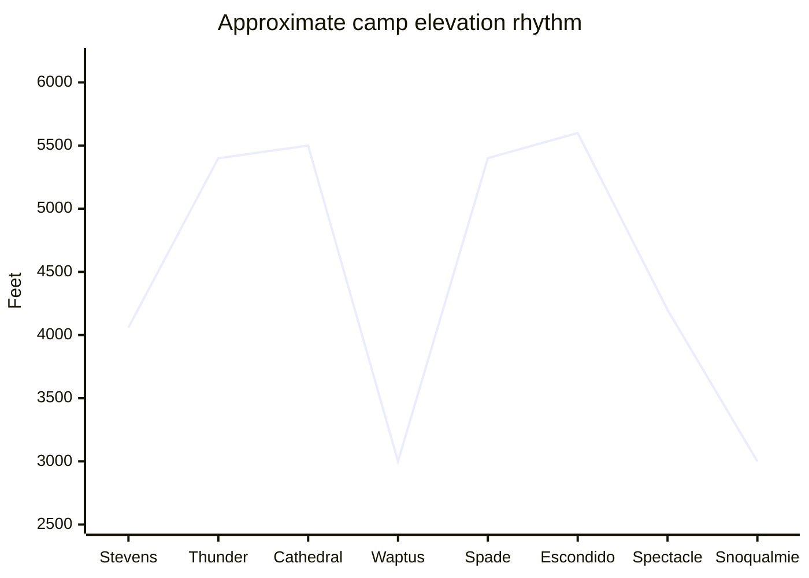

<section class="guide-hero">
  

    
Stevens Pass to Snoqualmie Pass | 6-12 September 2026

    <h1>PCT Section J Field Guide</h1>
    
A seven-day southbound plan for walking through the Alpine Lakes Wilderness with enough judgment, systems, and margin to enjoy the lakes and ridges instead of merely surviving them.

    

      <strong>Route</strong>Stevens Pass to Snoqualmie Pass
      <strong>Dates</strong>Sunday 6 Sep to Saturday 12 Sep 2026
      <strong>Distance</strong>About 75 PCT miles, up to 90 with side trips
      <strong>Mindset</strong>Stove, bear storage, offline maps, dry sleep layer
    

  

</section>

## Read This First

You are not going for a casual lake walk. You are going for a week on the Cascade crest, moving through remote country where the trail is usually obvious until weather, smoke, fatigue, injury, or a missed junction makes it less obvious. The trick is not to become fearless. The trick is to build small habits that make fear unnecessary most of the time.

The linked Trekking Mama itinerary is the right inspiration: start at Stevens Pass, walk south, sleep at beautiful lakes and high benches, and finish at Snoqualmie Pass. But there is a difference between an inspiring trip report and a field plan. A trip report tells you what worked once. A field plan tells you what to do when the ridge is socked in, one person is limping, the lake is too cold to swim, and the side trip no longer fits the day.

> [!DECISION]
> The safe version is a **seven-day southbound Section J hike from Sunday 6 September to Saturday 12 September 2026**, using the Trekking Mama camps as the scenic baseline, but treating Thunder Mountain Lakes, Peggy's Pond, Circle Lake, Spade, Venus, and even Spectacle time as conditional rewards. The PCT itself is the mission. Side trips are earned by weather, pace, feet, and daylight.

  
<strong>Primary rule</strong>If the group is behind schedule, cold, injured, or smoke-limited, cut side trips before cutting sleep, water, calories, or safety checks.

  
<strong>Fire rule</strong>Plan for **zero campfires**. Cook on a canister stove. A single possible legal window at lower Waptus is not enough to build a trip plan around.

  
<strong>Emergency rule</strong>Carry a satellite messenger or PLB, leave a written trip plan, and define the exact time your emergency contact should call for help.

This guide is current as of **25 May 2026**. Recheck closures, fire restrictions, food-storage rules, water comments, smoke, and the National Weather Service forecast during **30 August to 5 September 2026**, then again before stepping onto the trail.

## The Route Story

Southbound Section J begins at Stevens Pass on US 2 and ends at Snoqualmie Pass on I-90. WTA lists the section at **74.7 miles**, about **16,000 feet of gain**, and a highest point near **5,988 feet**. The Trekking Mama route adds side trips and turns the experience into roughly **90 miles**. That difference matters. With seven calendar days, every extra lake has to justify itself.

Think of the route in four acts.

First, you climb out of Stevens Pass into the northern lake country: Susan Jane, Mig, Hope, Trap, Surprise, Glacier, Deception. This is where your pack is heaviest, your rhythm is unproven, and the temptation to chase every lake is strongest.

Second, you cross the Cathedral and Waptus transition. Cathedral Pass feels high and exposed. Waptus feels lower, broader, and more forgiving. It is a morale reset, but it also sets up the steepest side-trip decision of the route.

Third, you enter the Spade, Venus, Escondido, and Spectacle chapter. This is the heart of the dramatic itinerary and also where mistakes compound. Steep climbs, exposed camps, cold lakes, and long descents punish tired feet.

Fourth, you exit through Spectacle, the Chickamin and Four Brothers high traverse, Ridge and Gravel Lakes, Kendall Katwalk, and the long drop to Snoqualmie. This is the day you do not want to begin depleted. It is scenic, rocky, airy in places, and long.

## The Seven-Day Itinerary

This is the exact working plan for **6-12 September 2026**, adapted from the Trekking Mama southbound itinerary. The side trips make it a full itinerary, not a soft one. Start early. Keep breaks efficient. Stop before decision quality collapses.

| Date | Route and camp | Mileage and elevation | Instructor's notes |
| --- | --- | --- | --- |
| Sun 6 Sep | Stevens Pass to Thunder Mountain Lakes | About 12 mi, +2,500 / -1,500 ft | First test of pack fit and pace. If weather is poor or arrival is late, shorten the day and do not force Thunder. |
| Mon 7 Sep | Thunder Mountain Lakes to Cathedral Pass meadow | About 17.5 mi, +2,800 / -2,200 ft | Big day through Glacier, Deception, and Cathedral terrain. Camp is exposed; arrive with dry layers protected. |
| Tue 8 Sep | Cathedral Pass to Peggy's Pond / Circle Lake to Waptus Lake | About 16.5-17 mi, +1,000 / -3,000 ft | Side trips are steep and rocky. If knees are sore, skip Circle. The long descent to Waptus is not a rest day. |
| Wed 9 Sep | Waptus Lake to Spade Lake | About 3-3.5 mi, +2,000 ft | Short on paper, hard in reality. This is a deliberate recovery and swim/read afternoon only if weather is stable. |
| Thu 10 Sep | Spade to Venus to Waptus to Escondido Ridge | About 13-14 mi, +4,000 / -3,500 ft | Hardest decision day. Venus is optional. Escondido is exposed; do not camp high into a deteriorating forecast. |
| Fri 11 Sep | Escondido Ridge to Spectacle Lake | About 7-8 mi, +1,000 / -1,500 ft | Shorter day by design. Dry gear, eat well, check the exit forecast, and prepare for a long final push. |
| Sat 12 Sep | Spectacle Lake to Snoqualmie Pass | About 17-18 mi, mostly descent | Long, rocky, exposed exit. Cross high country early, move carefully near Kendall Katwalk, and keep food/water available. |

> [!CHECK]
> The itinerary has one hidden trap: **Wednesday looks easy and Thursday looks heroic**. Do not let the short Waptus-to-Spade day convince you the route has become gentle. The energy saved on Wednesday is meant to protect Thursday and Saturday.

### Decision Gates

Use these gates without debate. They keep the group from negotiating with fatigue.

| Gate | If this is true | Decision |
| --- | --- | --- |
| Start of Day 2 | Feet are blistered, pack pain is sharp, or weather is worsening | Keep to the PCT and skip extra lake wandering. |
| Peggy's Pond junction | You are behind schedule, knees are sore, or clouds are dropping | Skip Peggy's and Circle. Descend to Waptus with daylight. |
| Waptus morning | Forecast calls for sustained rain, lightning, or strong wind | Skip Spade/Venus. Continue along the PCT corridor. |
| Spade morning | Anyone slept badly, is chilled, or has foot trouble | Skip Venus. Descend carefully and protect the Escondido climb. |
| Escondido camp | Ridge wind is building or visibility is poor | Camp lower if possible. Exposed beauty is not worth a bad night. |
| Spectacle morning | Final-day weather is ugly | Start before dawn, eat early, keep layers accessible, and stay together through exposed sections. |

## Elevation And Terrain

The route never reaches Himalayan altitude, but it repeatedly moves between forest, lake basins, passes, ridges, and rocky traverses. That means the problem is not oxygen. The problem is repeated effort, exposure, and weather.

| Section | What it feels like | What to do |
| --- | --- | --- |
| Stevens to Trap/Thunder | Forest climbs, lake basins, first pack-weight reality check | Keep the first day calm. Adjust straps early. Eat before you feel hungry. |
| Deception to Cathedral | Rolling lake country becomes pass-and-meadow travel | Watch weather and water. Exposed camps need layers and good tent staking. |
| Cathedral to Waptus | Long descent from alpine terrain into a lower basin | Protect knees. Use poles. Do not race downhill with a heavy pack. |
| Waptus to Spade/Venus | Steep side trail, talus, granite, cold alpine water | Only go if the group has margin. Treat swims as cold exposure. |
| Escondido to Spectacle | Ridge, tarns, creek zones, then a famous lake basin | Keep feet dry when possible. Check creek crossings after rain. |
| Spectacle to Snoqualmie | High traverse, rocky lakes, Kendall Katwalk, long descent | Start early. Avoid spacing out. The exit is still mountain travel. |

## Weather For 6-12 September

You cannot know the 2026 forecast yet. You can know the pattern. Early September is one of the best windows for this part of the Cascades, but "best" still includes cold rain, smoke, fog, wind, and the possibility of early snow or graupel at high points.

NOAA climate normals for Stevens Pass show September precipitation around **3.90 inches** for the month, with precipitation on roughly **8.4 days** of at least 0.01 inch. Snoqualmie Pass September averages from current climate summaries sit roughly around the low **60s F** by day and low **40s F** by night at pass level. High camps and windy ridges can feel much colder.

| Date | Camp zone | Planning temperature | Weather lesson |
| --- | --- | --- | --- |
| Sun 6 Sep | Thunder Mountain Lakes, high alpine basin | Fair: 45-65 F moving, 32-42 F night. Storm: 35-50 F and wet. | First night proves whether your sleep system and dry-bag discipline are real. |
| Mon 7 Sep | Cathedral Pass meadow | Fair: 42-62 F moving, 28-40 F night. | Exposed camp. Wind can make a mild forecast feel sharp. |
| Tue 8 Sep | Waptus Lake, lower basin | Fair: 50-70 F moving, 38-50 F night. | Lower and more protected, but condensation and damp gear still matter. |
| Wed 9 Sep | Spade Lake | Fair: 45-65 F moving, 30-42 F night. | Cold swim plus wind can steal heat fast. Dry off and dress immediately. |
| Thu 10 Sep | Escondido Ridge | Fair: 40-60 F moving, 28-40 F night. | This is the camp to abandon if wind, lightning, or dense cloud builds. |
| Fri 11 Sep | Spectacle Lake | Fair: 45-65 F moving, 32-44 F night. | Beautiful basin, but it can become a cold, wet holding pen in a storm. |
| Sat 12 Sep | Exit to Snoqualmie | Fair: 45-65 F moving. Storm: 35-50 F, rain, low visibility. | Final-day rain is plausible. Keep gloves, shell, snacks, and headlamp reachable. |

> [!WARNING]
> The dangerous Cascades temperature is not just "below freezing." It is **35-50 F with rain and wind**. That is hypothermia weather because people keep moving in wet clothes until their hands stop working and their judgment narrows.

### The Weather Checks That Matter

Check weather three ways before starting:

1. National Weather Service point forecasts for Stevens Pass, Snoqualmie Pass, and one or two high interior points near Spectacle or Cathedral.
2. Smoke forecast and air quality for Washington, plus visible fire activity on PCTA closures and InciWeb.
3. Recent WTA/FarOut reports for water, blowdowns, creek crossings, snow patches, and trail damage.

Cancel, reroute, or shorten if the forecast shows a multi-day cold storm, active closure, severe smoke, lightning pattern, or early snow that would obscure trail on high traverses.

## Permits, Rules, And Fire

You do **not** need a PCTA long-distance permit for this hike. PCTA long-distance permits are for trips of **500 or more continuous miles**. For Section J, use the local Alpine Lakes Wilderness permit system.

| Topic | Rule for this trip |
| --- | --- |
| Wilderness permit | Free, self-issued Alpine Lakes Wilderness permit from the trailhead or ranger station. Carry your copy. |
| Enchantments permit | Not relevant unless you detour into the Enchantments permit area. Do not accidentally plan that. |
| Parking | Northwest Forest Pass or posted trailhead fee rules may apply if leaving a car. Confirm at both ends. |
| Group size | Wilderness group limit is generally 12, but keep your group smaller for travel and campsite impact. |
| Drones and bikes | Wilderness means no drones, bikes, carts, or mechanized shortcuts. |

### Campfires By Day

The short answer: **plan for no campfires on the trail**.

Alpine Lakes Wilderness restrictions prohibit campfires above **4,000 feet** on the Mt. Baker-Snoqualmie side, above **5,000 feet** on the Okanogan-Wenatchee side, and within half a mile of many named lakes relevant to Section J, including Susan Jane, Mig, Hope, Josephine, Deep, Glacier, Ivanhoe, and Spectacle. September seasonal fire restrictions can be stricter and may ban campfires forest-wide outside developed rings.

| Night | Camp | Campfire answer |
| --- | --- | --- |
| Sun 6 Sep | Thunder Mountain Lakes | No. High alpine basin and likely above the relevant elevation threshold. |
| Mon 7 Sep | Cathedral Pass | No. High, exposed, fragile, and above practical fire limits. |
| Tue 8 Sep | Waptus Lake | The only plausible baseline candidate because it is lower, but do not plan on it. Seasonal restrictions may ban it, wood impact is real, and you still need a stove. |
| Wed 9 Sep | Spade Lake | No. High alpine lake basin. |
| Thu 10 Sep | Escondido Ridge | No. High, exposed, and poor fire terrain. |
| Fri 11 Sep | Spectacle Lake | No. Named lake with specific campfire restriction. |
| Sat 12 Sep | Finished | Use a restaurant, not a fire ring. |

> [!FIRE]
> If you remember one rule: **a legal stove is your kitchen; a campfire is not part of this itinerary**. Carry a canister stove or other pressurized fuel stove with a positive shutoff, and check the 2026 fire order wording before departure.

### If You Ever Make A Legal Fire Elsewhere

Practice this in a legal frontcountry campground, not for the first time in the Alpine Lakes Wilderness.

Use an existing ring. Clear loose burnable material. Keep water beside you. Gather only dead, downed wood that can be broken by hand: tinder, pencil-thin kindling, finger-thick sticks, then thumb-thick fuel. Start small. Feed air. Feed wood slowly. Keep flames below knee height. Never leave it unattended. When done, drown it, stir it, drown it again, and touch the ashes only when they are cold.

Do not cook your real dinner on a campfire. It is slow, dirty, weather-dependent, and may become illegal overnight. Cook on the stove. Marshmallows are fine morale food, but do not build a fire for them. Eat them plain, drop them into hot chocolate, or save them for a legal campground.

## Navigation System

Navigation is a layered system, not an app choice. Your phone is excellent until it is wet, dead, dropped, or wrong. Your paper map is excellent until you cannot orient it. Your compass is simple until you never practiced.

Carry all of this:

- **FarOut PCT** for offline PCT waypoints, camps, water comments, mileage, and current hiker notes.
- **Gaia GPS or CalTopo** with offline topo maps, slope shading if useful, and the current PCTA GPX/centerline.
- **Paper map** such as National Geographic Trails Illustrated PCT Washington North Map 1002, plus printed itinerary and bailouts.
- **Compass** with adjustable declination or a clear note of the local magnetic declination.
- **Battery reserve** dedicated to navigation and emergency communication.

### The Five Navigation Habits

1. At every break, point to where you are on the map.
2. Before leaving camp, name the next three features: pass, lake, junction, creek, ridge.
3. At each junction, stop moving before checking the phone.
4. If the trail direction and the map disagree, stop immediately. Do not "see where it goes."
5. If visibility drops, shorten spacing between hikers and confirm progress feature by feature.

### Emergency Direction Skills

Learn these before the flight:

- Orient a map with a compass.
- Take a bearing from map to terrain.
- Identify north from terrain and sun only as a rough backup, not as primary navigation.
- Use altimeter/elevation and contour lines to confirm where you are.
- Backtrack intentionally: mark your last known point, time, and direction.
- Follow "stop, think, observe, plan" if uncertain. Sitting down for five minutes is often faster than walking the wrong way for thirty.

## Water And Lakes

Section J has frequent water, but you still treat every natural source. Clear mountain water can carry pathogens from people, animals, and contaminated runoff.

Default carry:

- Move with **2 liters** most of the time.
- Have capacity for **3 liters** when climbing, dry camping, or crossing a longer dry stretch.
- Use **4 liters** only when comments or camp choice demand it. Water is heavy.

Known water rhythm is generally favorable: lakes and streams near the northern basins, Deception, Cathedral, Deep, Waptus, Spade/Venus, Cooper and Lemah zones, Spectacle, Ridge/Gravel, and creeks before Snoqualmie. Still, late-season seeps and small tarns must be checked in FarOut/WTA near departure.

### Squeeze Filter Procedure

1. Fill a dirty bottle or bag from flowing water when available.
2. Keep dirty threads and clean bottle mouths separate.
3. Screw the filter onto the dirty container.
4. Squeeze into a clean bottle or drink directly from the clean end.
5. Do not let dirty water run down into the clean bottle.
6. Backflush when flow slows.
7. If freezing is possible, sleep with the filter. A frozen hollow-fiber filter can fail invisibly.

Backup:

- Carry chlorine dioxide tablets.
- If the filter breaks, chemically treat according to label time.
- If water is cloudy, prefilter through a bandana, then treat.
- Boil if needed. CDC guidance is a rolling boil for 1 minute below 6,500 feet; Section J's high point is below that.

### Swimming In Alpine Lakes

Swims can be one of the great joys of the trip. They can also become the fastest way to turn a warm afternoon into a shaky evening.

The risks are cold-water shock, sudden drop-offs, submerged logs, foot entrapment, cramps, panic breathing, slick rock exits, and not being able to get warm afterward. Logs are not playground equipment. They roll, pin, hide branches, and make rescue harder.

Rules for lake swims:

- No solo swims.
- No distance swims.
- No diving or jumping from rocks, logs, or cliffs.
- Enter gradually. Control breathing before going deeper.
- Stay near shore and near an easy exit.
- Do not swim in wind, thunder, cold rain, dusk, or after alcohol.
- Dry off and put on warm layers immediately.
- If someone is shivering hard, clumsy, confused, or quiet, end the swim plan for the day.

## Food For Seven Days Plus Margin

You are hiking seven calendar days, but you should pack like you may need an eighth food day. That does not mean eight luxurious dinners. It means seven planned days plus one compact emergency layer that does not need cooking.

REI's backpacking planning range is **1.5-2.5 pounds of food per person per day**, or roughly **2,500-4,500 calories**. For this itinerary, most people should plan around **3,200-3,800 calories per trail day**, then adjust for body size and appetite.

| Appetite and output | Daily target | Seven trail days | With emergency margin |
| --- | ---: | ---: | ---: |
| Smaller appetite / efficient mover | 2,800-3,200 cal | 19,600-22,400 cal | Add 1,200-2,000 no-cook cal |
| Average strenuous backpacker | 3,200-3,800 cal | 22,400-26,600 cal | Add 2,000-3,000 no-cook cal |
| Large body / high output / cold sleeper | 3,800-4,500 cal | 26,600-31,500 cal | Add 3,000+ no-cook cal |

Aim for **110-140 calories per ounce**. High-density foods are usually fat-forward or dehydrated:

- Nut butter packets, nuts, trail mix, chocolate, olive oil packets.
- Tortillas, hard cheese, salami, jerky, tuna/chicken packets.
- Instant potatoes, ramen, couscous, dehydrated beans, freeze-dried meals.
- Bars you already like, candy, dried fruit, electrolyte drink mix.
- Hot drinks: cocoa, tea, miso, cider mix, instant coffee.

### A Simple Food Architecture

| Meal | Good pattern |
| --- | --- |
| Breakfast | Oats or granola, powdered milk, nut butter, coffee/tea. Keep it fast. |
| Walking food | Bars, trail mix, candy, jerky, dried fruit, electrolytes. Eat before energy crashes. |
| Lunch | Tortilla plus nut butter, cheese/salami, tuna/chicken, or hummus powder. No stove. |
| Dinner | Freeze-dried meal, ramen plus protein, couscous, instant potatoes, dehydrated chili. |
| Emergency | One no-cook meal per person plus extra bars, nuts, and drink mix. |

### MREs, Freeze-Dried Meals, And Burner Cooking

MRE-style meals are convenient because they can be eaten without cooking and often include a flameless heater, but they are heavy and bulky for a seven-day backpack. Freeze-dried meals are lighter and easier to pack, but they require water and fuel. Grocery-store meals are cheaper and can be excellent if you test them first.

For this route, use a **canister stove** and mostly boil-water meals. Avoid simmer-heavy meals because they burn fuel and attention. Bring one stove for two people plus a backup lighter. For a group, two small stoves are better than one fragile shared bottleneck.

Fuel planning depends on stove, wind, pot, and hot drink habits. For two people doing boil-only dinners and hot drinks, test your actual setup before the trip. Wind can double frustration, so use natural wind shelter without cooking inside the tent.

## Food Storage And Camp Kitchen

Both national forests relevant to Section J have food-storage orders. Mt. Baker-Snoqualmie has a forest-wide order effective through **15 April 2027**. Okanogan-Wenatchee has a forest-wide order effective through **30 June 2029** unless rescinded. The practical instruction is simple: bring an approved bear-resistant storage method.

For this group, the lowest-stress options are:

- A hard-sided bear canister if you can fit the food.
- An IGBC-approved bear-resistant bag if allowed by the exact current order and used correctly.

A perfect hang is hard in subalpine country and often impossible when tired. Do not build a plan around finding the perfect branch after dark.

Camp kitchen rules:

- Cook away from the tent.
- Store food, trash, toothpaste, sunscreen, lip balm, wrappers, and cookware residue together.
- Do not sleep with snacks.
- Do not leave packs unattended with food accessible.
- Put the canister somewhere stable where it cannot roll into water or off rock.
- Pack out every scrap, including tea bags, fruit peels, and spilled noodles.

## Clothing And Sleep System

Yes, **one hiking outfit, one sleeping outfit, and three pairs of underwear can be enough** if the rest of your clothing system is real.

The system:

- Hiking layer: synthetic or wool shirt, hiking pants/shorts, hiking underwear, hiking socks.
- Dry sleep layer: base top, base bottom, dry underwear if desired, dedicated dry socks.
- Weather layers: rain shell, rain pants or wind pants/skirt, fleece/active insulation, puffy, warm hat, gloves.
- Feet: 2-3 pairs hiking socks plus dry sleep socks.
- Shoes: broken-in trail runners or boots, not new footwear.

Three underwear strategy:

1. Wear one.
2. Dry one on pack or in camp.
3. Keep one clean/dry reserve.

Rinse only when you can dry the item. Wet clean underwear is not useful in cold rain. No cotton. Pack the dry sleep system inside a waterproof liner or dry bag and defend it like emergency equipment.

Sleep setup:

- 20-30 F quilt or bag.
- Insulated pad around R-value 3 or better.
- Sleep socks that never hike.
- Puffy accessible for camp.
- Tent pitched and guyed before you cook if weather is unstable.

## Power And Satellite Communication

For seven days, power is a conservation problem, not a charging fantasy.

Bring:

- Phone fully charged, offline maps downloaded.
- One **20,000 mAh** power bank per heavy phone/navigation user, or one 20,000-30,000 mAh shared bank plus smaller personal banks.
- Short known-good cables.
- Headlamp with fresh battery or recharge plan.
- Satellite messenger or PLB with active subscription/registration.

Minimal phone user can sometimes survive on 10,000 mAh. If you use the phone for photos, FarOut, Gaia, weather notes before losing service, and journaling, 20,000 mAh is the safer baseline.

Solar:

- Useful only as supplemental.
- Weak in forest, clouds, smoke, short September days, and while moving through shade.
- Better for long sunny breaks than for strapped-to-pack optimism.
- Do not carry solar instead of a properly sized battery.

Phone settings:

- Airplane mode.
- Low-power mode.
- Screen brightness low.
- Close background apps.
- Download maps before trail.
- Keep phone and bank warm at night.
- Do not use the phone as a flashlight except in emergency.

### Emergency Contact System

Best practice: carry a **Garmin inReach or similar two-way satellite messenger** with active subscription. A 406 MHz PLB such as an ACR ResQLink is also strong for emergency distress but does not support normal two-way check-ins. iPhone 14 or later Emergency SOS via satellite is a useful backup in the United States, but it is not a complete substitute for a dedicated device because it depends on phone battery, phone condition, sky view, and emergency-only workflows.

Before leaving:

- Set up device, subscription, contacts, and preset messages.
- Send a test message from outside.
- Teach both trekkers how to trigger SOS.
- Write a trip plan with camps, side-trip options, bailouts, and exit date.
- Tell one reliable person: "If you have not heard from us by **Sunday 13 September 2026 at noon Pacific Time**, call 911 or the relevant county sheriff and provide this route plan."

Check-in protocol:

- One "starting day" message.
- One "camped safely" message each night if sky view allows.
- One "delayed but okay" preset.
- One "non-life-threatening help needed" preset if your device supports it.
- SOS only for serious emergency.

## Wildlife, Plants, And Small Hazards

The animals are not villains. Bad food habits are the villain. Most wildlife problems start because people make food available.

Black bears are present in Washington. Cougars are present but rarely encountered. Rodents and small mammals are far more likely to chew gear. Mountain goats may be seen in nearby alpine country and should be given space. Snakes exist in Washington; the western rattlesnake is the only native venomous snake capable of a dangerous bite, but it is more associated with warmer, drier areas than the wet crest. Still, never put hands or feet where you cannot see.

Wildlife rules:

- Make noise in brush and near noisy water.
- Do not run from bear or cougar.
- If you see a black bear, speak calmly, back away, and give it space.
- If a black bear approaches persistently, get big, shout, group up, and use bear spray if carried and trained.
- If a cougar appears, stay upright, maintain eye contact, look large, back away, and fight back if attacked.
- Store all scented items properly.

Plants:

- Learn stinging nettle, poison oak/ivy, Devil's club, and thorny brush.
- Wear long pants in brush.
- Do not eat berries unless you are certain of identification.
- Wash exposed skin if you think you contacted an irritant plant.

Bugs and ticks:

- Use picaridin or DEET on skin as needed.
- Consider permethrin-treated clothing, never applied directly to skin.
- Do daily tick checks: socks, waistband, groin, armpits, scalp.
- Remove ticks with tweezers, pulling straight out.

## First Aid And Sprains

The best first aid is prevention: tested shoes, dry sleep socks, poles on descents, food before bonking, and not pretending a hot spot is "fine."

Minimum kit:

- Leukotape or blister tape, alcohol wipes, small scissors.
- Gauze, adhesive bandages, medical tape.
- Elastic bandage for sprains.
- Ibuprofen or acetaminophen, antihistamine, anti-diarrheal.
- Personal medications.
- Tweezers, small irrigation syringe, nitrile gloves.
- Emergency blanket.
- Tiny repair overlap: duct tape, Tenacious Tape, zip ties.

### Blisters

Treat hot spots immediately.

1. Stop.
2. Dry the area.
3. Apply tape smoothly without wrinkles.
4. Change socks if grit or moisture caused it.
5. Do not wait until skin is open.

### Sprains

A sprain, strain, and fracture can be hard to distinguish in the field. Treat the situation seriously.

1. Stop and remove the pack.
2. Check for deformity, severe swelling, numbness, tingling, or inability to bear weight.
3. Wrap with an elastic bandage from below the injury upward.
4. For an ankle, use a figure-eight around foot and ankle.
5. Compression should be snug, not tight. Toes must stay warm, pink, and normal-feeling.
6. Elevate during breaks.
7. Use trekking poles and redistribute pack weight.
8. Evacuate if pain worsens, the person cannot bear weight, or sensation/circulation changes.

## Campcraft

Good campcraft is boring while you do it and priceless when weather changes.

Arrive with enough daylight to:

- Choose a durable established site.
- Avoid fragile meadows, lake edges, drainages, widowmakers, and exposed ridgelines in wind.
- Pitch shelter before cooking if clouds are building.
- Collect and treat water.
- Put on dry layers before you are chilled.
- Cook away from the tent.
- Store food before crawling into the shelter.
- Set tomorrow's first snacks, water, shell, gloves, and headlamp where you can reach them.

Human waste:

- Use toilets where present.
- Otherwise dig catholes 6-8 inches deep and 200 feet from water where soil allows.
- Pack out toilet paper and wipes.
- Use hand sanitizer before touching food.

## Alcohol And The Rum Toddy Question

A rum toddy can be a morale ritual. It is not a survival tool.

Alcohol makes you lose heat faster, worsens balance, worsens judgment, dehydrates you, and makes nighttime bathroom trips riskier. It is especially dumb before water collection, food storage, navigation checks, or walking near lakes and rocks.

Rules:

- No alcohol while hiking.
- No alcohol before tent, water, dinner, food storage, and next-day plan are done.
- One modest drink only.
- Drink water with it.
- Never use alcohol to treat cold exposure.
- No swimming after drinking.
- Skip it if anyone is cold, wet, injured, nauseated, or unusually tired.

Lightweight toddy idea for a stable camp: tea or cider packet, hot water, one small rum portion, and a hard stop after that.

## Gear Checklist

Use this as the final packing list, then do a shakedown with the actual loaded pack.

| System | Bring |
| --- | --- |
| Pack | 50-65 L fitted backpack, pack liner, small dry bags, trash compactor bag. |
| Shelter | 3-season tent, footprint if used, stakes, guylines, repair sleeve/patch. |
| Sleep | 20-30 F bag/quilt, insulated pad, pillow or stuff sack pillow, sleep socks. |
| Kitchen | Canister stove, fuel, pot, spoon, mug, lighter, backup matches/lighter, small towel. |
| Water | Squeeze filter, dirty bag/bottle, clean bottles/bladder, chlorine dioxide backup, 2-3 L normal capacity. |
| Food storage | Bear canister or approved bear-resistant bag, odor bags if useful, trash bag. |
| Navigation | FarOut, Gaia/CalTopo offline, paper map, compass, printed itinerary. |
| Communication | Satellite messenger or PLB, phone, battery bank, cables, emergency contact plan. |
| Clothing | Hiking outfit, sleep base layers, rain shell, rain pants/wind pants, fleece, puffy, hat, gloves, socks, underwear. |
| First aid | Blister kit, elastic bandage, meds, gauze, tape, tweezers, gloves, emergency blanket. |
| Repair | Tenacious Tape, duct tape, zip ties, needle/thread, pad patch, small multitool. |
| Hygiene | Trowel, toilet paper/wipes packed out, sanitizer, toothbrush, toothpaste, sunscreen, lip balm. |
| Safety | Headlamp, spare battery, whistle, sunglasses, sun hat, emergency fire starter for survival only. |
| Comfort | Sit pad, book, tiny journal, cocoa, marshmallows, one camp luxury that does not steal safety margin. |

## Skills To Practice Before Flying

Do not outsource these to hope.

- Hike back-to-back days with the loaded pack.
- Pitch the tent in rain and wind.
- Cook a dinner with the exact stove and pot.
- Filter water from a shallow stream.
- Backflush the filter.
- Pack all food into the bear can or approved bag.
- Tape a hot spot on your own heel.
- Wrap an ankle with an elastic bandage.
- Navigate one short hike using offline map plus paper map.
- Send and receive a satellite test message.
- Pack the bag in the order you will use it in rain.

## Final Go/No-Go Checklist

Run this on **Saturday 5 September 2026** before starting.

- [ ] PCTA closures checked.
- [ ] Mt. Baker-Snoqualmie and Okanogan-Wenatchee alerts checked.
- [ ] Fire restrictions checked and stove type confirmed legal.
- [ ] Food storage order checked and storage method confirmed.
- [ ] NWS forecasts checked for Stevens, Snoqualmie, and interior high terrain.
- [ ] Smoke forecast and air quality checked.
- [ ] WTA, FarOut, and PCTA trail/water comments checked.
- [ ] Maps downloaded and opened offline.
- [ ] Paper map packed.
- [ ] Satellite messenger tested.
- [ ] Emergency contact has route, camps, device info, and overdue time.
- [ ] All food fits in storage system.
- [ ] Filter, backup tablets, and fuel packed.
- [ ] Dry sleep layer protected in waterproof storage.
- [ ] Exit transport from Snoqualmie confirmed.

> [!EMERGENCY]
> Turn around or exit early for worsening injury, uncontrolled shivering, confusion, severe smoke, active fire closure, lightning exposure, lost navigation confidence, broken shelter, broken water treatment with no backup, or a pace that means you will run out of food. Finishing the spreadsheet is not the goal. Getting both hikers home healthy is the goal.

## Sources To Recheck

Route and itinerary:

- [The Trekking Mama Section J southbound itinerary](https://www.thetrekkingmama.com/hiking-pct-section-j-solo-7-days-70-miles-and-why-long-trails-are-different/)
- [WTA: PCT Section J](https://www.wta.org/go-hiking/hikes/pacific-crest-trail-section-j-snoqualmie-pass-to-stevens-pass-east)
- [PCT Washington: Section J southbound description](https://pctwashington.com/descriptions/section_j)

Permits, closures, fire, and regulations:

- [PCTA permits](https://www.pcta.org/discover-the-trail/permits/)
- [PCTA local permit areas](https://www.pcta.org/discover-the-trail/permits/local-permits/)
- [PCTA closures](https://closures.pcta.org/)
- [PCTA trail conditions](https://www.pcta.org/discover-the-trail/trail-conditions/)
- [Mt. Baker-Snoqualmie wilderness regulations](https://www.fs.usda.gov/r06/mbs/recreation/wilderness-regulations)
- [Okanogan-Wenatchee Alpine Lakes Wilderness](https://www.fs.usda.gov/r06/okanogan-wenatchee/recreation/alpine-lakes-wilderness-okanogan-wenatchee)
- [Alpine Lakes Wilderness restrictions order PDF](https://www.fs.usda.gov/sites/nfs/files/r06/okanogan-wenatchee/publication/alerts/Alpine%20Lakes%20Wilderness%20Restrictions%20CO%20%2306-17-1994-001.pdf)
- [Mt. Baker-Snoqualmie food storage order](https://www.fs.usda.gov/r06/mbs/alerts/entire-forest-under-food-storage-order)
- [Okanogan-Wenatchee food storage order](https://www.fs.usda.gov/r06/okanogan-wenatchee/alerts/safe-storage-possession-and-handling-food-and-refuse-forestwide)
- [InciWeb wildfire incidents](https://inciweb.wildfire.gov/)

Weather, water, and safety:

- [National Weather Service Snoqualmie Pass point forecast](https://forecast.weather.gov/MapClick.php?lat=47.4290&lon=-121.4099)
- [NOAA Climate Normals](https://www.ncei.noaa.gov/products/land-based-station/us-climate-normals)
- [Washington wildfire smoke](https://ecology.wa.gov/Air-Climate/Air-quality/Smoke-fire/Wildfire-smoke)
- [CDC backcountry water treatment](https://www.cdc.gov/drinking-water/prevention/water-treatment-hiking-camping-traveling.html)
- [Washington State Parks cold water safety](https://parks.wa.gov/about/rules-and-safety/boater-education-safety/cold-water-safety)
- [Washington DOH lake, river, and beach safety](https://doh.wa.gov/community-and-environment/water-recreation/lake-river-and-beach-safety)
- [PCTA emergency beacons and trip plans](https://www.pcta.org/discover-the-trail/backcountry-basics/safety-tips/emergency-beacon-search-rescue-trip-plan/)

Gear, food, maps, and wildlife:

- [PCTA navigation](https://www.pcta.org/discover-the-trail/backcountry-basics/navigation/)
- [PCTA maps](https://www.pcta.org/discover-the-trail/maps/)
- [PCTA PCT data](https://www.pcta.org/discover-the-trail/maps/pct-data/)
- [National Geographic PCT maps](https://www.natgeomaps.com/trail-maps/trails-illustrated-maps/pacific-crest-trail)
- [REI backpacking food planning](https://www.rei.com/learn/expert-advice/planning-menu.html)
- [REI backpacking checklist](https://www.rei.com/learn/expert-advice/backpacking-checklist.html)
- [REI solar chargers and portable power](https://www.rei.com/learn/expert-advice/solar-chargers-portable-power.html)
- [WDFW black bear](https://wdfw.wa.gov/species-habitats/species/ursus-americanus)
- [WDFW cougar](https://wdfw.wa.gov/species-habitats/species/puma-concolor)
- [WDFW snakes](https://wdfw.wa.gov/species-habitats/living/snakes)
- [WTA poisonous plants](https://www.wta.org/go-outside/trail-smarts/how-to/how-to-avoid-poisonous-plants-on-a-hike)

