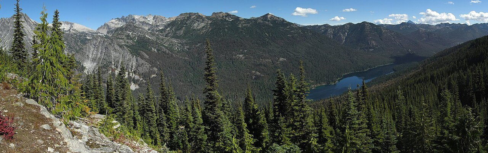
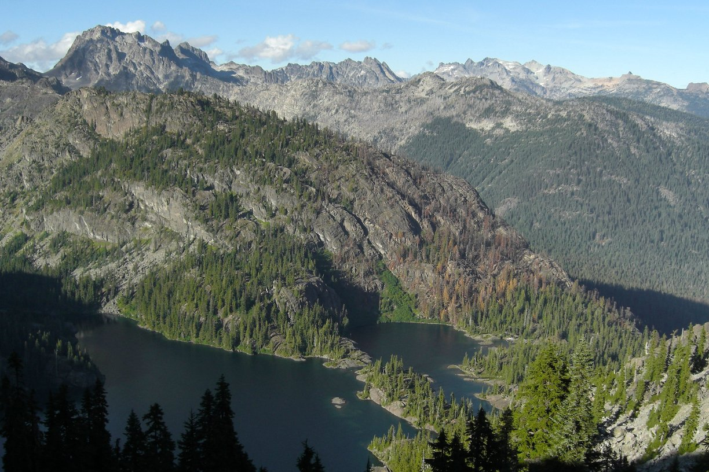
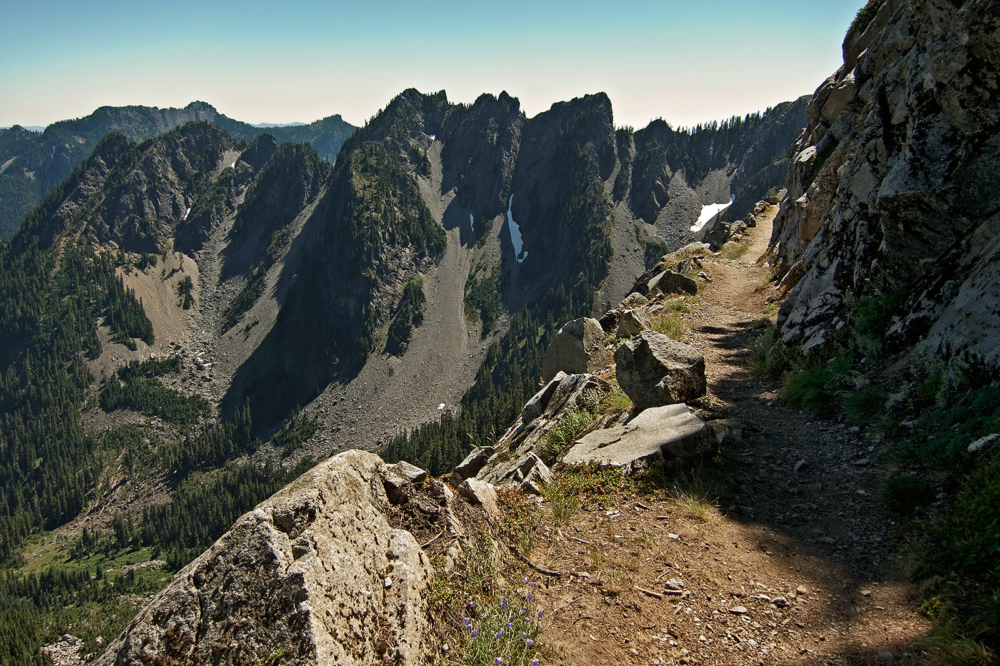
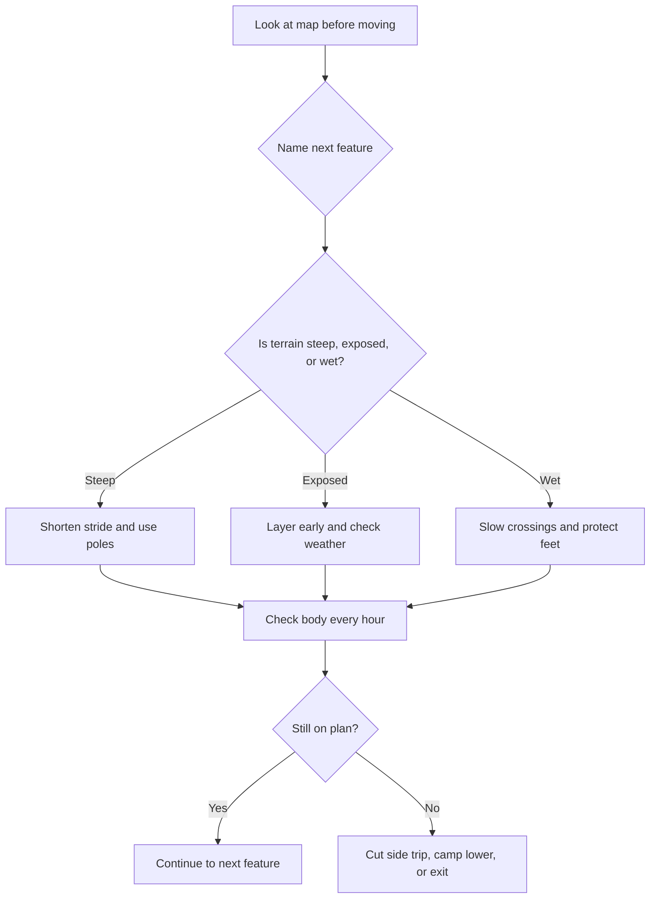
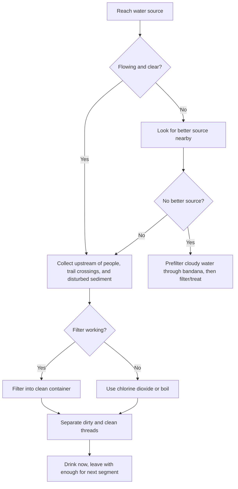
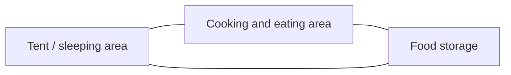

<section class="guide-hero">
  

    
Stevens Pass to Snoqualmie Pass | 6-12 September 2026

    <h1>PCT Section J Field Guide</h1>
    
A seven-day southbound plan for walking through the Alpine Lakes Wilderness with enough judgment, systems, and margin to enjoy the lakes and ridges instead of merely surviving them.

    

      <strong>Route</strong>Stevens Pass to Snoqualmie Pass
      <strong>Dates</strong>Sunday 6 Sep to Saturday 12 Sep 2026
      <strong>Distance</strong>About 120 PCT km, up to 145 km with side trips
      <strong>Mindset</strong>Stove, bear storage, offline maps, dry sleep layer
    

  

</section>

## Read This First

You are not going for a casual lake walk. You are going for a week on the Cascade crest, moving through remote country where the trail is usually obvious until weather, smoke, fatigue, injury, or a missed junction makes it less obvious. The trick is not to become fearless. The trick is to build small habits that make fear unnecessary most of the time.

The linked Trekking Mama itinerary is the right inspiration: start at Stevens Pass, walk south, sleep at beautiful lakes and high benches, and finish at Snoqualmie Pass. But there is a difference between an inspiring trip report and a field plan. A trip report tells you what worked once. A field plan tells you what to do when the ridge is socked in, one person is limping, the lake is too cold to swim, and the side trip no longer fits the day.

> [!DECISION]
> The safer working version is a **seven-day southbound Section J hike from Sunday 6 September to Saturday 12 September 2026**, using the Trekking Mama camps as the scenic baseline, but treating Thunder Mountain Lakes, Peggy's Pond, Circle Lake, Spade, Venus, and even Spectacle time as conditional rewards. The PCT itself is the mission. Side trips are earned by weather, pace, feet, and daylight.

  
<strong>Primary rule</strong>If the group is behind schedule, cold, injured, or smoke-limited, cut side trips before cutting sleep, water, calories, or safety checks.

  
<strong>Fire rule</strong>Plan for **zero campfires**. Cook on a canister stove. A single possible legal window at lower Waptus is not enough to build a trip plan around.

  
<strong>Emergency rule</strong>Carry a satellite messenger or PLB, leave a written trip plan, and define the exact time your emergency contact should call for help.

This guide is current as of **2 June 2026**. Recheck closures, fire restrictions, food-storage rules, water comments, smoke, product specs, and the National Weather Service forecast during **30 August to 5 September 2026**, then again before stepping onto the trail.

## How To Use This Guide

Read this once like a book, then use it like a field manual. The first read gives you the full story: where the route goes, how the days build on each other, and why the safety systems matter. The second read should be done with your actual gear on the floor. Every time the guide says "carry," "practice," or "decide," turn that sentence into a physical action.

The goal is not to memorize every fact. The goal is to build enough pattern recognition that the trail stops surprising you in dangerous ways. You want to recognize the moment a fun swim is becoming cold stress, the moment a side trip is stealing tomorrow's legs, the moment a map check should happen before the group keeps walking, and the moment a warm camp ritual has to be skipped because the wind is changing.

Think in four layers:

| Layer | What it answers | Your standard |
| --- | --- | --- |
| Route | Where are we going and what are the escape options? | Everyone can name today's destination, next major feature, and the plan if someone slows down. |
| Body | Are we warm, fed, hydrated, and mobile? | No one hides hot spots, shivering, nausea, or sharp pain to protect group morale. |
| Systems | Do navigation, shelter, food, water, and communication still work? | Every critical system has a backup or a practiced workaround. |
| Judgment | Are we still making good decisions? | Side trips, swims, alcohol, photos, and summit fever lose to daylight, weather, injury, and food margin. |

> [!FIELD]
> A good backpacker is not someone who suffers quietly. A good backpacker notices small problems early, fixes them while they are cheap, and keeps the group out of situations where courage becomes the main tool.

## Group Operating Rules

First-time long-distance trekkers need explicit team rules because fatigue makes polite ambiguity dangerous. Decide these before the trailhead.

| Rule | Standard |
| --- | --- |
| Leader and sweep | The front hiker manages pace; the sweep makes sure nobody gets quietly dropped. Rotate roles if needed. |
| Regroup points | Regroup at every junction, pass, creek crossing, and confusing campsite approach. No one walks through a decision point alone. |
| Spacing | Keep visual or voice contact in poor visibility, exposed terrain, creek crossings, and late-day fatigue. |
| Stop phrase | Anyone can say "stop, check" for feet, weather, water, navigation, or morale. The group stops without debate. |
| No silent suffering | Hot spots, chills, nausea, dizziness, sharp pain, or unusually dark mood must be named early. |
| Split rule | The group does not split unless the route, time, gear, communication, and rendezvous are explicit. |
| Quit rule | If one person needs to exit, shared gear is redistributed before anyone separates. Nobody leaves with the only shelter, stove, filter, map, first-aid kit, or satellite messenger. |
| Daily captain | One person each day owns time checks, but not command authority. Safety concerns outrank the daily plan. |

The best group is not the fastest group. It is the group where small problems surface early enough to solve cheaply.

## The Route Story

Southbound Section J begins at Stevens Pass on US 2 and ends at Snoqualmie Pass on I-90. WTA lists the full section at **120.2 km**, about **4,875 m of gain**, and a highest point near **1,825 m**. USFS route descriptions may describe a shorter distance for the PCT segment through the Alpine Lakes Wilderness itself, and app distances can differ by data source. Use one distance authority for your plan and treat every side trip as additive. The Trekking Mama route adds side trips and turns the experience into roughly **145 km**. That difference matters. With seven calendar days, every extra lake has to justify itself.

Think of the route in four acts.

First, you climb out of Stevens Pass into the northern lake country: Susan Jane, Mig, Hope, Trap, Surprise, Glacier, Deception. This is where your pack is heaviest, your rhythm is unproven, and the temptation to chase every lake is strongest.

Second, you cross the Cathedral and Waptus transition. Cathedral Pass feels high and exposed. Waptus feels lower, broader, and more forgiving. It is a morale reset, but it also sets up the steepest side-trip decision of the route.

Third, you enter the Spade, Venus, Escondido, and Spectacle chapter. This is the heart of the dramatic itinerary and also where mistakes compound. Steep climbs, exposed camps, cold lakes, and long descents punish tired feet.

Fourth, you exit through Spectacle, the Chickamin and Four Brothers high traverse, Ridge and Gravel Lakes, Kendall Katwalk, and the long drop to Snoqualmie. This is the day you do not want to begin depleted. It is scenic, rocky, airy in places, and long.

  <figure>
    
    <figcaption>Waptus is the psychological reset: lower, broader, and tempting. It is also the launch point for the steep Spade/Venus decision.</figcaption>
  </figure>
  <figure>
    
    <figcaption>Spectacle is the reward basin, but it should still be treated as mountain camp: cold water, food storage, and an early exit plan.</figcaption>
  </figure>
  <figure>
    
    <figcaption>Kendall Katwalk terrain is why the final day is not just a walk out. Keep layers, water, snacks, and attention available.</figcaption>
  </figure>

## The Seven-Day Itinerary

This is the exact working plan for **6-12 September 2026**, adapted from the Trekking Mama southbound itinerary. The side trips make it a full itinerary, not a soft one. Start early. Keep breaks efficient. Stop before decision quality collapses.

| Date | Route and camp | Distance and elevation | Instructor's notes |
| --- | --- | --- | --- |
| Sun 6 Sep | Stevens Pass to Thunder Mountain Lakes | About 19 km, +760 m / -460 m | First test of pack fit and pace. If weather is poor or arrival is late, shorten the day and do not force Thunder. |
| Mon 7 Sep | Thunder Mountain Lakes to Cathedral Pass meadow | About 28 km, +850 m / -670 m | Big day through Glacier, Deception, and Cathedral terrain. Camp is exposed; arrive with dry layers protected. |
| Tue 8 Sep | Cathedral Pass to Peggy's Pond / Circle Lake to Waptus Lake | About 26.5-27.5 km, +305 m / -915 m | Side trips are steep and rocky. If knees are sore, skip Circle. The long descent to Waptus is not a rest day. |
| Wed 9 Sep | Waptus Lake to Spade Lake | About 5-6 km, +610 m | Short on paper, hard in reality. This is a deliberate recovery and swim/read afternoon only if weather is stable. |
| Thu 10 Sep | Spade to Venus to Waptus to Escondido Ridge | About 21-22.5 km, +1,220 m / -1,065 m | Hardest decision day. Venus is optional. Escondido is exposed; do not camp high into a deteriorating forecast. |
| Fri 11 Sep | Escondido Ridge to Spectacle Lake | About 11-13 km, +305 m / -460 m | Shorter day by design. Dry gear, eat well, check the exit forecast, and prepare for a long final push. |
| Sat 12 Sep | Spectacle Lake to Snoqualmie Pass | About 27-29 km, mostly descent | Long, rocky, exposed exit. Cross high country early, move carefully near Kendall Katwalk, and keep food/water available. |

> [!CHECK]
> The itinerary has one hidden trap: **Wednesday looks easy and Thursday looks heroic**. Do not let the short Waptus-to-Spade day convince you the route has become gentle. The energy saved on Wednesday is meant to protect Thursday and Saturday.

### First-Timer Reality Gate

This itinerary is beautiful, but it is not automatically reasonable just because it fits on seven calendar days. With a 14.5-20.5 kg starting pack, first-time long-distance trekkers should earn the side trips before committing to them.

Before the trip, each hiker should be able to pass this gate:

| Gate | Pass standard | If you miss it |
| --- | --- | --- |
| Loaded distance | Two back-to-back hikes of 18-22 km with the actual shoes and at least 12-15 kg pack weight | Cut side trips first; do not pretend trail adrenaline fixes conditioning. |
| Climbing | One loaded hike with 700-1,000 m of gain or equivalent stair/hill work | Keep the PCT corridor as the mission and treat Spade/Venus as optional. |
| Feet | No worsening blisters, toenail pain, or hot spots after the second day | Change shoe/sock/lacing system before departure. |
| Camp speed | Shelter, water, dinner, food storage, and dry sleep setup completed calmly in 60 minutes | Practice until camp does not consume the whole evening. |
| Morning speed | Packed and walking within 90 minutes of waking | Start earlier, simplify breakfast, or reduce camp complexity. |
| Recovery | You wake up able to walk again without limping | Redesign the route or shorten high-output days. |

If the gate fails, the answer is not shame. The answer is a better plan: skip Peggy's/Circle, skip Venus, skip Spade if needed, camp lower, or turn Section J into a PCT-focused traverse rather than a lake-collecting mission.

### Daily Field Notes

#### Day 1: Sunday 6 September - Stevens Pass To Thunder Mountain Lakes

The first day is when you learn whether your plan exists outside a spreadsheet. The pack is heaviest, your shoulders are still adapting, and the trail immediately asks for climbing. Start early enough that you are not racing evening light into camp. Stop within the first hour to adjust hip belt, shoulder straps, shoe lacing, and trekking pole length. Small discomforts on day one become injuries by day three if you pretend they are normal.

Your instructor mindset for day one is simple: **move smoothly, not heroically**. Eat before hunger. Drink before thirst. Fix hot spots immediately. If weather is worse than expected, if someone is slower than expected, or if you arrive at a decision point late, shorten the plan. The first night should prove that your shelter, dry sleep clothes, food storage, and stove workflow all work.

Day-one camp priorities:

- Pitch the shelter before wandering for photos.
- Change into a dry layer before you are chilled.
- Treat enough water for dinner, overnight, and the first morning.
- Confirm tomorrow's route features: Glacier, Deception, and the Cathedral transition.
- Send the first satellite "camped safely" message if sky view allows.

#### Day 2: Monday 7 September - Thunder Mountain Lakes To Cathedral Pass Meadow

This is the first big-distance day. You are moving through lake country and then toward higher, more exposed terrain. The danger is not a single dramatic hazard. It is the slow accumulation of pack rub, damp socks, late breaks, and optimistic pacing. Cathedral-area camping is beautiful, but exposed camps punish poor tent staking and careless dry-bag habits.

Before leaving camp, ask each person to answer three questions out loud: Where is the next reliable water? What is the next major climb or pass? What is the latest time we are willing to keep pushing before choosing a simpler camp? This forces the group to carry a shared map in its head.

Day-two instructor cues:

- If clouds lower, treat the next pass as a navigation checkpoint, not just scenery.
- If feet are tender, tape them before the long middle of the day.
- If wind is building, camp selection matters more than views.
- If someone is quiet, stumbling, or not eating, stop and diagnose the body problem before it becomes a morale problem.

#### Day 3: Tuesday 8 September - Cathedral To Waptus, With Peggy's Pond And Circle Only If Earned

This day looks like a descent into relief, but the side trips can turn it into a trap. Peggy's Pond and Circle Lake are rewards, not obligations. The long descent to Waptus asks for controlled knees, active poles, and patience. Long downhill kilometres with a loaded pack are where blisters, toenail pain, and ankle slips show up.

The Waptus basin is lower and friendlier, but do not let that reset your discipline. Treat water, store food, keep camp clean, and protect your dry sleep layer. If you arrive with daylight and energy, use the evening to repair gear, air feet, organize food, and study the Spade decision. Do not use Waptus as an excuse to stay up late.

#### Day 4: Wednesday 9 September - Waptus To Spade Lake

This is the shortest-distance day and one of the most important days of the trip. The climb to Spade is steep enough to turn a "rest day" into a sweaty, exposed effort. The correct use of this day is recovery: get to camp with margin, dry gear, eat a real meal, inspect feet, and decide honestly whether Venus and Escondido still make sense tomorrow.

If you swim, do it like a cold-water drill, not like a beach day. Enter slowly. Stay close to shore. Have dry clothes staged. No distance swimming. No jumping from logs or rocks. Get warm before the shivering becomes a problem.

#### Day 5: Thursday 10 September - Spade, Venus, Waptus, Escondido Ridge

This is the queen stage. It asks for climbing legs, descent control, route discipline, and weather judgment. Venus is optional. Escondido Ridge is optional if conditions are deteriorating. The PCT corridor and a lower camp are legitimate success, not failure.

The decision point is not "Can we physically do it?" Many groups can physically keep moving long after they have stopped making good decisions. The question is: **Can we do it and still arrive with warm layers dry, dinner cooked, food stored, and tomorrow protected?**

Before committing high, check:

- Time remaining before dark.
- Cloud base and wind trend.
- Everyone's feet and knees.
- Actual food eaten so far today.
- Water available for camp and morning.
- Whether a lower campsite gives you a safer night.

#### Day 6: Friday 11 September - Escondido Ridge To Spectacle Lake

This is designed as a shorter day because the final day is long. Do not burn the spare time on carelessness. Use Spectacle as a full reset: wash feet away from the lake, dry socks, inventory food, pack the final-day snack system, check weather if any service exists, and set a real departure time.

Spectacle can feel celebratory, but it is not the finish. The most common last-night mistake is letting the mind arrive before the body does. Your exit day still has rocky tread, exposure, and a long descent.

#### Day 7: Saturday 12 September - Spectacle Lake To Snoqualmie Pass

Start earlier than you think you need to. The exit is long, and the terrain can be slow when wet or when legs are tired. Keep the group together through exposed or confusing sections, especially in poor visibility. Do not pack snacks so deeply that you stop eating. Do not bury rain gear because "we are almost out." Almost out is still out.

The final day standard: every person reaches Snoqualmie with enough awareness to cross trailheads, roads, parking lots, and pickup logistics safely. Many accidents happen after people mentally finish.

### Decision Gates

Use these gates without debate. They keep the group from negotiating with fatigue.

| Gate | If this is true | Decision |
| --- | --- | --- |
| Start of Day 2 | Feet are blistered, pack pain is sharp, or weather is worsening | Keep to the PCT and skip extra lake wandering. |
| Peggy's Pond junction | You are behind schedule, knees are sore, or clouds are dropping | Skip Peggy's and Circle. Descend to Waptus with daylight. |
| Waptus morning | Forecast calls for sustained rain, lightning, or strong wind | Skip Spade/Venus. Continue along the PCT corridor. |
| Spade morning | Anyone slept badly, is chilled, or has foot trouble | Skip Venus. Descend carefully and protect the Escondido climb. |
| Escondido camp | Ridge wind is building or visibility is poor | Camp lower if possible. Exposed beauty is not worth a bad night. |
| Spectacle morning | Final-day weather is ugly | Start before dawn, eat early, keep layers accessible, and stay together through exposed sections. |

### Bailout And Exit Playbook

Bailouts are not magic doors. They are alternate hikes with their own distance, descent, road access, and transport problems. Mark these on paper and digital maps before departure, then verify current trail status in WTA/FarOut/PCTA comments.

| Situation | Likely exit concept | What it costs | Road/service reality | Emergency handoff |
| --- | --- | --- | --- | --- |
| Early injury before Cathedral/Waptus | Backtrack north toward Stevens Pass or use a mapped north-side trail exit if closer | Distance may still be long; do not assume downhill is easy | US 2 access is better than interior exits, but service is still patchy | Call 911/SOS; describe nearest trail, pass, creek, or lake. |
| Trouble around Deception/Cathedral | Deception-area exits toward US 2 if clearly safer than continuing | Long descent and navigation attention; verify exact route before trip | Road pickup must be preplanned; do not count on rideshare | County may depend on exact drainage; give coordinates. |
| Waptus basin injury or schedule failure | Exit east/southeast via Waptus/Cle Elum/Salmon La Sac approach | Long walk out, often 20+ km depending location | Road access is remote; arrange pickup/shuttle deliberately | Likely Kittitas County side if exiting toward Cle Elum. |
| Spade/Venus plan is failing | Return to Waptus and stay on PCT corridor | Costs the side trip, saves the trip | Better camps and water than exposed high terrain | No rescue needed if group can walk and communicate. |
| Escondido/Spectacle weather problem | Camp lower if possible or continue PCT only; do not force ridges in poor visibility | May mean a longer final day or changed camp | Service unreliable until nearer Snoqualmie | Use satellite messenger if safety margin is shrinking. |
| Final-day injury near Snoqualmie side | Continue only if safe; otherwise stop, shelter, and communicate | Shorter distance does not mean low consequence | Snoqualmie/King County access improves near pass | King County/Snoqualmie-area responders likely if near I-90 side. |

Write this into the emergency contact plan: "If we press SOS, our device coordinates are primary. If we are overdue without SOS, call 911 and ask for the sheriff/search-and-rescue jurisdiction covering our last known segment. We may be in King, Kittitas, Chelan, or Snohomish County depending location."

### Daylight Budget

Early September gives useful daylight, but long days still punish late starts. Use conservative first-trek pacing: loaded travel often averages **2.0-3.0 km/h including breaks** on hard terrain, slower on steep side trails, wet rock, or blister days.

| Day | Latest normal start | Mandatory check | Cutoff decision |
| --- | --- | --- | --- |
| Sun 6 Sep | 08:00 if logistics allow | First hour: pack/shoe adjustment and pace check | If weather or pace is poor by mid-afternoon, shorten before Thunder. |
| Mon 7 Sep | 06:30-07:00 | Midday: confirm feet, food eaten, and Cathedral timing | If behind by 14:00, choose the simpler legal camp option. |
| Tue 8 Sep | 06:30-07:00 | Peggy/Circle decision before committing off-corridor | If knees or time are bad, skip side trips and descend to Waptus. |
| Wed 9 Sep | 08:00 is acceptable only if weather is stable | Top of climb: assess heat, water, and camp timing | If storms build, skip swim and secure camp. |
| Thu 10 Sep | 06:00-06:30 | Waptus return timing and Escondido weather | If Venus costs too much, skip it. If ridge weather worsens, camp lower. |
| Fri 11 Sep | 07:00 | Spectacle arrival with enough time for full reset | If delayed, protect food/water/sleep before photography. |
| Sat 12 Sep | 05:30-06:30 | High traverse before weather/traffic fatigue builds | If moving slowly, eat early, group up, and use headlamps before dusk. |

Headlamps are for contingencies, not permission to plan sloppy days. If the group is repeatedly walking into camp after dark, the itinerary is too ambitious.

## Elevation And Terrain

The route never reaches Himalayan altitude, but it repeatedly moves between forest, lake basins, passes, ridges, and rocky traverses. That means the problem is not oxygen. The problem is repeated effort, exposure, and weather.

  

    <strong>Stevens</strong>
    1,237 m
  

  

    <strong>Thunder</strong>
    1,646 m
  

  

    <strong>Cathedral</strong>
    1,676 m
  

  

    <strong>Waptus</strong>
    914 m
  

  

    <strong>Spade</strong>
    1,646 m
  

  

    <strong>Escondido</strong>
    1,707 m
  

  

    <strong>Spectacle</strong>
    1,280 m
  

  

    <strong>Snoqualmie</strong>
    914 m
  

| Section | What it feels like | What to do |
| --- | --- | --- |
| Stevens to Trap/Thunder | Forest climbs, lake basins, first pack-weight reality check | Keep the first day calm. Adjust straps early. Eat before you feel hungry. |
| Deception to Cathedral | Rolling lake country becomes pass-and-meadow travel | Watch weather and water. Exposed camps need layers and good tent staking. |
| Cathedral to Waptus | Long descent from alpine terrain into a lower basin | Protect knees. Use poles. Do not race downhill with a heavy pack. |
| Waptus to Spade/Venus | Steep side trail, talus, granite, cold alpine water | Only go if the group has margin. Treat swims as cold exposure. |
| Escondido to Spectacle | Ridge, tarns, creek zones, then a famous lake basin | Keep feet dry when possible. Check creek crossings after rain. |
| Spectacle to Snoqualmie | High traverse, rocky lakes, Kendall Katwalk, long descent | Start early. Avoid spacing out. The exit is still mountain travel. |

### How To Read The Terrain Before It Reads You

On a map, Section J is not one continuous climb. It is a repeated pattern: climb out of forest, cross high lake country, descend, then climb again. That rhythm matters because recovery is never complete. A long descent can be as damaging as a climb, especially with a full food carry. The goal is to arrive at every camp with knees, feet, hands, and decision quality still intact.

Use this terrain language:

| Terrain feature | What it means on the ground | How to move |
| --- | --- | --- |
| Tight contour lines | Steep ground, slower pace, more ankle risk | Short steps, poles active, no rushing downhill. |
| Wide contour spacing | Gentler ground or basin travel | Eat, drink, and recover while walking. |
| Saddle or pass | Wind, exposure, weather change, navigation checkpoint | Layer before cold, confirm next drainage, do not linger in lightning. |
| Ridge travel | Views plus exposure to wind/smoke/weather | Keep shell accessible and watch group spacing. |
| Lake basin | Camp temptation, cold air pooling, condensation | Choose durable sites, protect dry clothes, store food early. |
| Creek drainage | Water and navigation handrail | Treat water, watch slippery rocks, confirm which drainage you are following. |

### Altitude And Breathing

The high point is under 1,830 m, so altitude illness is not the central problem for most people. Still, people arriving from sea level or from long travel days can feel unusually winded on climbs. Do not confuse that with weakness. Shorten your stride, breathe steadily, and keep eating. The bigger risk is pushing so hard on early climbs that you stop drinking, stop noticing feet, and arrive in camp too depleted to do camp tasks well.

## Weather For 6-12 September

You cannot know the 2026 forecast yet. You can know the pattern. Early September is one of the best windows for this part of the Cascades, but "best" still includes cold rain, smoke, fog, wind, and the possibility of early snow or graupel at high points.

NOAA climate normals for Stevens Pass show September precipitation around **99 mm** for the month, with precipitation on roughly **8.4 days** of at least 0.25 mm. A higher/interior reference such as Olallie Meadows shows that nearby Cascade terrain can be wetter, around **139 mm** over roughly **9.6 wet days** in September normals. Snoqualmie Pass September averages from current climate summaries sit roughly around the mid-teens C by day and around 5 C by night at pass level. High camps and windy ridges can feel much colder.

| Date | Camp zone | Planning temperature | Weather lesson |
| --- | --- | --- | --- |
| Sun 6 Sep | Thunder Mountain Lakes, high alpine basin | Fair: 7-18 C moving, 0-6 C night. Storm: 2-10 C and wet. | First night proves whether your sleep system and dry-bag discipline are real. |
| Mon 7 Sep | Cathedral Pass meadow | Fair: 6-17 C moving, -2 to 4 C night. | Exposed camp. Wind can make a mild forecast feel sharp. |
| Tue 8 Sep | Waptus Lake, lower basin | Fair: 10-21 C moving, 3-10 C night. | Lower and more protected, but condensation and damp gear still matter. |
| Wed 9 Sep | Spade Lake | Fair: 7-18 C moving, -1 to 6 C night. | Cold swim plus wind can steal heat fast. Dry off and dress immediately. |
| Thu 10 Sep | Escondido Ridge | Fair: 4-16 C moving, -2 to 4 C night. | This is the camp to abandon if wind, lightning, or dense cloud builds. |
| Fri 11 Sep | Spectacle Lake | Fair: 7-18 C moving, 0-7 C night. | Beautiful basin, but it can become a cold, wet holding pen in a storm. |
| Sat 12 Sep | Exit to Snoqualmie | Fair: 7-18 C moving. Storm: 2-10 C, rain, low visibility. | Final-day rain is plausible. Keep gloves, shell, snacks, and headlamp reachable. |

> [!WARNING]
> The dangerous Cascades temperature is not just "below freezing." It is **2-10 C with rain and wind**. That is hypothermia weather because people keep moving in wet clothes until their hands stop working and their judgment narrows.

### The Weather Checks That Matter

Check weather three ways before starting:

1. National Weather Service point forecasts for Stevens Pass, Snoqualmie Pass, and one or two high interior points near Spectacle, Chikamin, Cathedral, or Olallie-style interior terrain.
2. Smoke forecast and air quality for Washington, plus visible fire activity on PCTA closures and InciWeb.
3. Recent WTA/FarOut reports for water, blowdowns, creek crossings, snow patches, and trail damage.
4. NWS forecast discussion, mountain forecast, freezing/snow levels, and wind timing if the pattern looks unsettled.

Cancel, reroute, or shorten if the forecast shows a multi-day cold storm, active closure, severe smoke, lightning pattern, or early snow that would obscure trail on high traverses.

### Weather Masterclass: What The Forecast Is Really Telling You

A mountain forecast is not a promise. It is a set of probabilities over complicated terrain. The forecast for Snoqualmie Pass may not describe the wind at Cathedral, the overnight low at Spade, or the smoke trapped in a basin. Read the forecast as a threat model.

| Forecast phrase | Field meaning | Your response |
| --- | --- | --- |
| Chance of showers | You may spend hours in wet brush or cold rain | Pack shell where reachable, defend dry sleep layer, tape feet early. |
| Mostly cloudy | Less solar drying, colder breaks, harder solar charging | Do not rely on sun to dry socks or charge devices. |
| Wind 25-40 km/h | Exposed camps feel much colder; tent pitch matters | Camp lower or behind terrain, stake carefully, cook in sheltered air. |
| Thunderstorms | Passes, ridges, and lake basins become bad places to linger | Start early, avoid high exposure in the afternoon, descend if building. |
| Smoke or haze | Slower pace, sore throat, poor visibility, reduced enjoyment | Check AQI, carry mask if sensitive, cut effort and side trips. |
| Snow level near route elevation | Trail may disappear and rocks become slick | Cancel, reroute, or carry skills/gear beyond normal backpacking. |

### Cold Rain Protocol

Cold rain is the most realistic September emergency. The key is to act before you are shaking too hard to work buckles, lighters, zippers, and maps.

1. Put on shell before base layers soak through.
2. Keep one warm layer dry for camp. Do not hike in the only dry insulation unless stopping would be worse.
3. Eat small amounts often. Cold people often stop eating because tasks feel annoying.
4. Keep gloves or liner gloves accessible. Hands fail early.
5. Shorten breaks. A standing snack break may be safer than a long sit.
6. At camp, shelter comes first, then dry clothes, then hot food.
7. If someone is confused, clumsy, slurring, stumbling, or no longer shivering despite being cold, treat it as an emergency.

### Lightning Protocol

If thunder follows lightning, you are already in the decision zone. Do not wait for dramatic weather on a ridge.

- Leave passes, ridges, isolated high points, and exposed lake shores.
- Spread out slightly if exposed, but keep visual contact.
- Avoid lone trees, metal trekking poles held upright, and shallow caves or overhangs.
- Descend to lower, more uniform terrain if you can do so safely.
- Wait 30 minutes after the last thunder before resuming exposed travel.

### Smoke Protocol

Smoke can be merely unpleasant or trip-ending. It reduces views, slows pace, irritates lungs, and can hide the very mountains you are using for navigation. If AQI is unhealthy or a fire is creating closure risk, do not negotiate with the plan. Section J is not worth lung damage or getting trapped between closure points.

## Permits, Rules, And Fire

You do **not** need a PCTA long-distance permit for this hike. PCTA long-distance permits are for trips of **800 km or more** of continuous travel. For Section J, use the local Alpine Lakes Wilderness permit system.

| Topic | Rule for this trip |
| --- | --- |
| Wilderness permit | Free, self-issued Alpine Lakes Wilderness permit from the trailhead or ranger station. Carry your copy. |
| Enchantments permit | Not relevant unless you detour into the Enchantments permit area. Do not accidentally plan that. |
| Parking | Northwest Forest Pass or posted trailhead fee rules may apply if leaving a car. Confirm at both ends. |
| Group size | Wilderness group limit is generally 12, but keep your group smaller for travel and campsite impact. |
| Drones and bikes | Wilderness means no drones, bikes, carts, or mechanized shortcuts. |

### The Rule-Checking Ritual

Rules change faster than printed plans. On **Saturday 5 September 2026**, do this as a group call or screen-share. One person reads; one person writes the final answer into the trip plan.

1. Open PCTA closures and confirm Section J is open from Stevens Pass to Snoqualmie Pass.
2. Open Mt. Baker-Snoqualmie alerts and Okanogan-Wenatchee alerts.
3. Check fire restrictions for both forests, not just wilderness baseline rules.
4. Confirm whether your stove type is allowed under the current fire order.
5. Confirm food storage wording and whether your storage method is accepted.
6. Check trailhead parking and transportation timing.
7. Save screenshots or PDFs of the critical pages for offline reference.

> [!RULE]
> Treat online comments as hints and agency rules as authority. If a hiker comment says "fires were fine last year" and the current forest order says no fires, the order wins.

### Campfires By Day

The short answer: **plan for no campfires on the trail**.

Alpine Lakes Wilderness restrictions prohibit campfires above **1,220 m** on the Mt. Baker-Snoqualmie side, above **1,525 m** on the Okanogan-Wenatchee side, and within 800 m of many named lakes relevant to Section J, including Susan Jane, Mig, Hope, Josephine, Deep, Glacier, Ivanhoe, and Spectacle. September seasonal fire restrictions can be stricter and may ban campfires forest-wide outside developed rings.

| Night | Camp | Campfire answer |
| --- | --- | --- |
| Sun 6 Sep | Thunder Mountain Lakes | No. High alpine basin and likely above the relevant elevation threshold. |
| Mon 7 Sep | Cathedral Pass | No. High, exposed, fragile, and above practical fire limits. |
| Tue 8 Sep | Waptus Lake | The only plausible baseline candidate because it is lower, but do not plan on it. Seasonal restrictions may ban it, wood impact is real, and you still need a stove. |
| Wed 9 Sep | Spade Lake | No. High alpine lake basin. |
| Thu 10 Sep | Escondido Ridge | No. High, exposed, and poor fire terrain. |
| Fri 11 Sep | Spectacle Lake | No. Named lake with specific campfire restriction. |
| Sat 12 Sep | Finished | Use a restaurant, not a fire ring. |

> [!FIRE]
> If you remember one rule: **a legal stove is your kitchen; a campfire is not part of this itinerary**. Carry a canister stove or other pressurized fuel stove with a positive shutoff, and check the 2026 fire order wording before departure.

### If You Ever Make A Legal Fire Elsewhere

Practice this in a legal frontcountry campground, not for the first time in the Alpine Lakes Wilderness.

Use an existing ring. Clear loose burnable material. Keep water beside you. Gather only dead, downed wood that can be broken by hand: tinder, pencil-thin kindling, finger-thick sticks, then thumb-thick fuel. Start small. Feed air. Feed wood slowly. Keep flames below knee height. Never leave it unattended. When done, drown it, stir it, drown it again, and touch the ashes only when they are cold.

Do not cook your real dinner on a campfire. It is slow, dirty, weather-dependent, and may become illegal overnight. Cook on the stove. Marshmallows are fine morale food, but do not build a fire for them. Eat them plain, drop them into hot chocolate, or save them for a legal campground.

### Fire Skill Without Fire Dependence

A survival expert learns fire because fire is a powerful emergency tool. A responsible wilderness traveler also learns when not to use it. On this itinerary, your normal heat comes from clothing, shelter, food, and movement. Fire is not your warmth plan.

If you practice in a legal campground, learn the structure:

| Material | Size | Job | Mistake to avoid |
| --- | --- | --- | --- |
| Tinder | Dry grass, shavings, fire starter, tiny twigs | Catches the spark/flame | Expecting damp bark to ignite. |
| Kindling | Pencil-thin dry sticks | Builds the first stable flame | Adding large wood too early. |
| Fuel | Finger to thumb thick | Sustains heat | Building a bonfire instead of a small controlled fire. |
| Water | Full bottle/pot nearby | Control and extinguish | Searching for water after the fire is already too hot. |

Extinguishing is a skill, not a vibe. Drown, stir, feel, repeat. If it is too hot to touch, it is too hot to leave.

## Navigation System

Navigation is a layered system, not an app choice. Your phone is excellent until it is wet, dead, dropped, or wrong. Your paper map is excellent until you cannot orient it. Your compass is simple until you never practiced.

Carry all of this:

- **FarOut PCT** for offline PCT waypoints, camps, water comments, distance, and current hiker notes.
- **Gaia GPS or CalTopo** with offline topo maps, slope shading if useful, and the current PCTA GPX/centerline.
- **Paper map** such as National Geographic Trails Illustrated PCT Washington North Map 1002, plus printed itinerary and bailouts.
- **Compass** with adjustable declination or a clear note of the local magnetic declination.
- **Battery reserve** dedicated to navigation and emergency communication.

### The Navigation Stack

Do not ask "Which app should I use?" Ask "What failure can I survive?"

| Tool | What it is best at | How it fails | Your countermeasure |
| --- | --- | --- | --- |
| FarOut | PCT distance, comments, camps, water, user notes | Phone battery, stale comments, tunnel vision on icons | Download offline, read comments critically, cross-check with map. |
| Gaia or CalTopo | Topo context, alternate trails, GPX tracks, slope/terrain awareness | Bad downloads, confusing layers, battery drain | Download the exact area and test airplane mode. |
| Paper map | Big-picture terrain, bailouts, no battery | Useless if not oriented or packed away | Keep accessible and practice with it before the trip. |
| Compass | Direction and map orientation | Declination confusion, no practice | Set or write declination and drill before flying. |
| Brain | Pattern recognition | Fatigue, stress, group pressure | Name features out loud and stop early when uncertain. |

### App Download Details

Offline does not mean "I opened it once at home." Test each app in airplane mode.

- **FarOut:** download the PCT guide section and any background map layers you expect to use. Comments and map tiles are not the same thing.
- **Gaia GPS:** download the active map source for the route corridor, then zoom in while offline to confirm details render.
- **CalTopo:** save the map area and the specific layers you need. A saved route without saved tiles is not enough.
- **PCTA GPX/data:** save the official centerline/waypoints or confirm your app's PCT data is current.
- **NWS forecasts:** save or screenshot text forecasts close to departure because service may disappear immediately.

Phone GPS can still work in airplane mode, but apps need their map data already stored. Your preflight test is simple: restart the phone, enable airplane mode, open the app, zoom in to Section J, and confirm route, topo, camps, and your blue dot or GPS position all work.

### Junction Discipline

The PCT feels obvious until it does not. The north half of this hike has several trails, lake approaches, creek drainages, and side-trip temptations around Icicle Creek, Tunnel Creek, Surprise Creek, Deception Creek, Lake Clarice, Deception Pass, and the Cathedral/Waptus transition. Do not walk through junctions while talking.

At every junction:

1. Stop before entering the intersection.
2. Identify the sign, trail name/number, or mapped junction.
3. Say the intended direction and next terrain feature out loud.
4. Say the wrong-way clue: "If we start dropping toward the wrong drainage, we stop."
5. Confirm on one digital map and, for major decisions, the paper map.
6. Only then move.

> [!RULE]
> A junction is not a place to drift. It is a decision point. The whole group should leave it knowing where the trail goes next.

### Map Reading: The Terrain Grammar

A topographic map is not a decoration. It is a compressed model of the land. Learn these before the trek:

- **Contour lines close together** mean steep terrain. Expect slower pace and more slip risk.
- **Contour lines far apart** mean gentler terrain. Expect easier walking or basin travel.
- **V-shaped contour bends** usually point upstream in drainages. They help you identify creek direction.
- **Closed loops** are hills or depressions. Higher numbers uphill; hachures may mark depressions on some maps.
- **Saddles and passes** are low points between higher terrain. They often become wind gates and navigation checkpoints.
- **Ridges** shed water away. **Drainages** collect water and often contain creeks.
- **Index contours** are the darker/labeled contours. Use them to estimate elevation quickly.

If your phone shows you on a slope, the paper map should show the same story. If your body says you are climbing but the map says you should be descending, stop and resolve the mismatch.

### Compass Basics For This Trip

You do not need to become an orienteering racer. You need four practical skills:

1. **Orient the map.** Lay the map flat. Turn it until map north matches compass north after accounting for declination. Now the terrain and map face the same way.
2. **Check direction of travel.** If the next lake is south of the pass on the map, your trail should generally trend south after the pass. If it trends north for a long time, ask why.
3. **Take a rough bearing.** Line the compass edge from your location to the target, rotate the bezel to map north, then follow the direction arrow after accounting for declination.
4. **Use back bearings.** If you walk away from a known point in poor visibility, know the reverse direction that returns you.

Washington's magnetic declination is large enough that ignoring it can matter. Check the current value for your map/date near print time with NOAA's calculator, set it on an adjustable compass if possible, and write the value on your printed itinerary. Do not hard-code an old declination number into the plan and forget when it was calculated.

### Navigation Concepts That Save Time

| Concept | Plain-English meaning | Section J example |
| --- | --- | --- |
| Handrail | A feature you can follow | PCT tread, creek drainage, ridge, lake shore where travel is allowed. |
| Catch feature | A feature that tells you if you went too far | A pass, major creek, lake outlet, road, large junction. |
| Attack point | An obvious feature near a harder target | Use a signed junction before finding a side trail or campsite. |
| Bailout | A planned exit if continuing is unsafe | Deception-area exits, Waptus/Cle Elum approaches, or finishing to Snoqualmie depending on location. |
| Last known point | The last place you were certain of location | A signed junction, named creek, lake outlet, or GPS-confirmed camp. |

### The Lost-But-Not-Yet-In-Trouble Protocol

Most people do not become lost in one dramatic instant. They become uncertain, keep moving, and convert uncertainty into distance. Stop that chain early.

1. **Stop.** Do not let the group drift while someone "just checks something."
2. **Think.** What was the last place we were certain? How long ago? What direction have we walked since?
3. **Observe.** Terrain, slope, water direction, trail quality, footprints, blazes/signs, GPS, map.
4. **Plan.** Choose one action: backtrack to last known point, continue to a catch feature, or stay put and communicate.
5. **Mark.** Drop a waypoint or write time/location in notes before moving again.

> [!EMERGENCY]
> If you are off route, weather is worsening, daylight is fading, or someone is injured, stop trying to solve it by walking farther. Preserve heat, preserve battery, preserve group cohesion, and communicate from the best sky-view location you can safely reach.

### The Five Navigation Habits

1. At every break, point to where you are on the map.
2. Before leaving camp, name the next three features: pass, lake, junction, creek, ridge.
3. At each junction, stop moving before checking the phone.
4. If the trail direction and the map disagree, stop immediately. Do not "see where it goes."
5. If visibility drops, shorten spacing between hikers and confirm progress feature by feature.

### Emergency Direction Skills

Learn these before the flight:

- Orient a map with a compass.
- Take a bearing from map to terrain.
- Identify north from terrain and sun only as a rough backup, not as primary navigation.
- Use altimeter/elevation and contour lines to confirm where you are.
- Backtrack intentionally: mark your last known point, time, and direction.
- Follow "stop, think, observe, plan" if uncertain. Sitting down for five minutes is often faster than walking the wrong way for thirty.

### Navigation Drills Before The Trip

Do these on any local trail before flying.

| Drill | How to do it | Pass standard |
| --- | --- | --- |
| Airplane mode test | Download maps, turn on airplane mode, restart phone, open maps. | You can see route, topo, waypoints, and your location without service. |
| Three-feature habit | At every break, name your current location, next feature, and feature after that. | Everyone in the group can answer without looking at one person's phone. |
| Paper map orientation | Use compass to orient map, then point to visible terrain features. | The map and landscape agree. |
| Backtrack drill | Walk 10 minutes, mark last known point, then navigate back without following breadcrumbs blindly. | You can return calmly and explain the route. |
| Battery drill | Use normal navigation for a full day hike, then check phone and bank usage. | You know your real daily battery draw. |

## Water And Lakes

Section J has frequent water, but you still treat every natural source. Clear mountain water can carry pathogens from people, animals, and contaminated runoff.

Default carry:

- Move with **2 L** most of the time.
- Have capacity for **3 L** when climbing, dry camping, or crossing a longer dry stretch.
- Use **4 L** only when comments or camp choice demand it. Water is heavy.

Known water rhythm is generally favorable: lakes and streams near the northern basins, Deception, Cathedral, Deep, Waptus, Spade/Venus, Cooper and Lemah zones, Spectacle, Ridge/Gravel, and creeks before Snoqualmie. Still, late-season seeps and small tarns must be checked in FarOut/WTA near departure.

### Water Decision Tree

### Choosing A Source

Best source: cold, flowing water from a stream above campsites and away from obvious animal or human contamination. Good source: lake outlet or clear lake water collected away from muddy edges. Last-resort source: warm stagnant tarn, silty puddle, or water near heavy camp use. Last-resort water can still be made usable, but you should prefilter and treat carefully.

Avoid collecting:

- Immediately downstream of campsites, stock use, trail crossings, or obvious feces.
- From shallow muddy edges where every scoop stirs sediment.
- From water with surface scum or heavy algae if another source exists.
- From the same place people are washing bodies, dishes, or socks.

### Squeeze Filter Procedure

1. Fill a dirty bottle or bag from flowing water when available.
2. Keep dirty threads and clean bottle mouths separate.
3. Screw the filter onto the dirty container.
4. Squeeze into a clean bottle or drink directly from the clean end.
5. Do not let dirty water run down into the clean bottle.
6. Backflush when flow slows.
7. If freezing is possible, sleep with the filter. A frozen hollow-fiber filter can fail invisibly.

Backup:

- Carry chlorine dioxide tablets.
- If the filter breaks, chemically treat according to label time.
- If water is cloudy, prefilter through a bandana, then treat.
- Boil if needed. CDC guidance is a rolling boil for 1 minute below 1,980 m; Section J's high point is below that.

Know the limits. Most common squeeze filters are excellent for protozoa and bacteria, but they are not virus purifiers unless specifically designed and certified for that, and they do not remove chemical pollution or toxins from harmful algal blooms. Your best defense is source selection plus treatment, not blind faith in clear water.

### Filter Failure Modes

| Failure | What it looks like | Prevention or fix |
| --- | --- | --- |
| Frozen hollow fibers | Filter may look normal but no longer be reliable | Sleep with the filter if freezing is possible. Do not let it freeze. |
| Clogged filter | Flow slows to a trickle | Backflush, prefilter silty water, avoid scooping sediment. |
| Dirty/clean cross-contamination | Dirty water touches clean bottle threads | Keep containers separated and wipe threads if uncertain. |
| Pinhole in dirty bag | Water leaks under pressure | Carry backup dirty bottle/bag or use bottle threads directly. |
| Lost gasket | Filter leaks at connection | Carry spare gasket if your filter uses one. |

### Hydration And Electrolytes

Dehydration is not the only water problem. Drinking huge amounts of plain water without salts while sweating hard can also make you feel bad. Use food and electrolytes together.

Trail rhythm:

- Start each morning with water already treated.
- Drink some at camp before leaving.
- Carry 2 L by default, more for climbs, dry camps, hot days, or uncertainty.
- Use electrolyte mix on hard, sweaty days, especially days 2, 5, and 7.
- Watch urine color, headache, dizziness, unusual fatigue, nausea, and cramps as signals to stop and assess.
- Do not ration water into dehydration if the next source is uncertain. Slow down and solve the source problem.

### Swimming In Alpine Lakes

Swims can be one of the great joys of the trip. They can also become the fastest way to turn a warm afternoon into a shaky evening.

The risks are cold-water shock, sudden drop-offs, submerged logs, foot entrapment, cramps, panic breathing, slick rock exits, and not being able to get warm afterward. Logs are not playground equipment. They roll, pin, hide branches, and make rescue harder.

Rules for lake swims:

- No solo swims.
- No distance swims.
- No diving or jumping from rocks, logs, or cliffs.
- Enter gradually. Control breathing before going deeper.
- Stay near shore and near an easy exit.
- Do not swim in wind, thunder, cold rain, dusk, or after alcohol.
- Dry off and put on warm layers immediately.
- If someone is shivering hard, clumsy, confused, or quiet, end the swim plan for the day.

### Cold-Water Swim Procedure

Use this if conditions are warm, stable, and the group is not tired or impaired.

1. Choose an easy shore entry with a visible bottom and a simple exit.
2. Stage towel, dry base layer, puffy, hat, and warm drink supplies before entering.
3. Assign a watcher who is not swimming at that moment.
4. Enter gradually. Splash torso and control breathing before going deeper.
5. Stay within a few strokes of shore.
6. Exit before teeth chatter or hands become clumsy.
7. Dry skin, dress, and keep moving lightly until warm.

Do not swim after alcohol, in thunder, in wind, near floating logs, at dusk, or when anyone is already cold. A lake can be beautiful and still be a bad idea.

  <figure>
    
    <figcaption>Lower lakes can feel forgiving, but the water is still cold and camp discipline still matters: clean kitchen, treated water, stored food.</figcaption>
  </figure>
  <figure>
    
    <figcaption>Alpine water is scenery, drinking source, and hazard at once. Swim only with a warm exit plan and keep soap/food waste out of the lake.</figcaption>
  </figure>

## Food For Seven Days Plus Margin

You are hiking seven calendar days, but you should pack like you may need an eighth food day. That does not mean eight luxurious dinners. It means seven planned days plus one compact emergency layer that does not need cooking.

REI's backpacking planning range converts to roughly **0.68-1.13 kg of food per person per day**, or roughly **2,500-4,500 kcal**. For this itinerary, most people should plan around **3,200-3,800 kcal per trail day**, then adjust for body size and appetite.

| Appetite and output | Daily target | Seven trail days | With emergency margin |
| --- | ---: | ---: | ---: |
| Smaller appetite / efficient mover | 2,800-3,200 kcal | 19,600-22,400 kcal | Add 1,200-2,000 no-cook kcal |
| Average strenuous backpacker | 3,200-3,800 kcal | 22,400-26,600 kcal | Add 2,000-3,000 no-cook kcal |
| Large body / high output / cold sleeper | 3,800-4,500 kcal | 26,600-31,500 kcal | Add 3,000+ no-cook kcal |

Aim for **3.9-4.9 kcal/g** for high-density snacks and pantry foods. High-density foods are usually fat-forward or dehydrated:

- Nut butter packets, nuts, trail mix, chocolate, olive oil packets.
- Tortillas, hard cheese, salami, jerky, tuna/chicken packets.
- Instant potatoes, ramen, couscous, dehydrated beans, freeze-dried meals.
- Bars you already like, candy, dried fruit, electrolyte drink mix.
- Hot drinks: cocoa, tea, miso, cider mix, instant coffee.

### The Expert Food Rule: Calories You Actually Eat

Food planning fails when people pack mathematically perfect food they dislike. Your trail food must satisfy three tests:

1. **You can eat it while tired.** If it sounds good only at home, it is not reliable.
2. **It survives heat, crushing, and repetition.** A smashed bar is fine; a leaking packet is not.
3. **It fits your cooking system.** If dinner needs simmering, chopping, or cleanup, it is stealing evening energy.

For Section J, food has four jobs:

| Job | What it does | Examples |
| --- | --- | --- |
| Fast fuel | Keeps you moving between breaks | Candy, gummies, bars, dried fruit, drink mix. |
| Durable calories | High density with little fuss | Nuts, nut butter, olive oil, chocolate, hard cheese, salami. |
| Recovery meal | Warm, salty, easy dinner | Freeze-dried meal, ramen with protein, couscous, instant potatoes. |
| Emergency food | No-cook margin if delayed | Bars, nuts, tortillas, jerky, nut butter, electrolyte packets. |

### Sample Seven-Day Food Pattern

This is not a required menu. It is a model you can copy and adjust.

| Day part | Daily example | Instructor note |
| --- | --- | --- |
| Breakfast | Instant oats or granola, powdered milk, nut butter, coffee | Keep breakfast fast. Long cooking in the morning delays departure. |
| First pocket snack | Bar plus candy or dried fruit | Eat in the first 90 minutes, not after the bonk. |
| Lunch | Two tortillas with salami/cheese or nut butter/honey | No stove. Sit, eat, socks/feet check, move. |
| Afternoon snack | Trail mix, jerky, electrolyte drink | Afternoon is where pace fades if you under-eat. |
| Dinner | Freeze-dried meal or ramen/potatoes/couscous plus protein and oil | Hot, salty, simple. Add olive oil for calories. |
| Camp drink | Cocoa, tea, cider, miso | Warmth and morale without needing a fire. |
| Emergency layer | One no-cook meal plus 2-4 dense snacks | Do not eat this unless delayed or exiting under stress. |

### Packing The Food

Pack by day or by meal, but make the day's walking food reachable. The common mistake is sealing everything beautifully into a bear canister and then not eating enough because snacks are buried.

Recommended method:

1. Build seven daily snack bags.
2. Build seven dinner/breakfast sets.
3. Mark the emergency food clearly.
4. Put smellable packaging inside the approved storage system.
5. Keep one active snack bag accessible during the day.
6. Repack trash each night into the food storage system.

If using a bear canister, practice loading the exact food before the trip. Seven days of bulky packaging may not fit unless you remove excess cardboard, puncture no packages, and choose compact foods.

### A Simple Food Architecture

| Meal | Good pattern |
| --- | --- |
| Breakfast | Oats or granola, powdered milk, nut butter, coffee/tea. Keep it fast. |
| Walking food | Bars, trail mix, candy, jerky, dried fruit, electrolytes. Eat before energy crashes. |
| Lunch | Tortilla plus nut butter, cheese/salami, tuna/chicken, or hummus powder. No stove. |
| Dinner | Freeze-dried meal, ramen plus protein, couscous, instant potatoes, dehydrated chili. |
| Emergency | One no-cook meal per person plus extra bars, nuts, and drink mix. |

### Sample Metric Food Day

This is a practical template, not a diet prescription. Build one day, eat it on a training hike, then multiply only if it actually works for your appetite.

| Meal block | Example | Weight | Energy |
| --- | --- | ---: | ---: |
| Breakfast | Oats or granola, milk powder, nut butter, coffee | 140-180 g | 650-850 kcal |
| Morning snacks | Bar, gummies, nuts, electrolyte mix | 180-230 g | 750-1,000 kcal |
| Lunch | Tortillas with salami/cheese or nut butter/honey | 220-300 g | 850-1,150 kcal |
| Afternoon snacks | Trail mix, chocolate, jerky, drink mix | 180-250 g | 800-1,100 kcal |
| Dinner | Freeze-dried meal or ramen/potatoes/couscous plus protein and oil | 150-230 g | 700-1,050 kcal |
| Camp drink | Cocoa, tea, miso, cider | 20-40 g | 50-180 kcal |

Daily total: roughly **0.9-1.2 kg** and **3,800-5,300 kcal** if you pack generously; roughly **0.7-0.9 kg** and **3,000-3,800 kcal** if you pack tighter. For seven days plus emergency margin, expect about **5.0-7.5 kg of food per person** depending appetite, food density, and how much comfort food you allow.

Bear-can fit method: pack day 7 at the bottom, day 1 at the top, remove cardboard, flatten pouches after eating, and keep one active snack bag outside only for the current walking day.

### MREs, Freeze-Dried Meals, And Burner Cooking

MRE-style meals are convenient because they can be eaten without cooking and often include a flameless heater, but they are heavy and bulky for a seven-day backpack. Freeze-dried meals are lighter and easier to pack, but they require water and fuel. Grocery-store meals are cheaper and can be excellent if you test them first.

For this route, use a **canister stove** and mostly boil-water meals. Avoid simmer-heavy meals because they burn fuel and attention. Bring one stove for two people plus a backup lighter. For a group, two small stoves are better than one fragile shared bottleneck.

Fuel planning depends on stove, wind, pot, and hot drink habits. For two people doing boil-only dinners and hot drinks, test your actual setup before the trip. Wind can double frustration, so use natural wind shelter without cooking inside the tent.

MRE reality check: a standard military MRE is roughly a meal's worth of calories and is durable, but a full case is heavy and bulky. MREs are useful as a no-cook backup or one comfort meal. They are a poor primary strategy for seven days unless you accept the weight and trash volume.

### Fuel Planning Method

The Decathlon MT500 stove lists 200 g/hour fuel consumption, but your real number depends on pot, water temperature, wind, altitude, and patience. Estimate fuel by testing grams per litre boiled, not by vibes.

Test at home or on a shakedown:

1. Weigh a fuel canister before boiling.
2. Boil exactly 1 L of water with your pot and lid.
3. Turn off immediately after boil.
4. Weigh the canister again.
5. Repeat once in breezy conditions using natural wind shelter.
6. Use the worse number, multiply by expected litres, then add 30% margin.

Beginner starting estimate for two people on this itinerary:

| Use | Litres boiled | Fuel planning note |
| --- | ---: | --- |
| Dinner for two, 7 nights | 7-10 L | Freeze-dried meals usually need less water than ramen/pot meals. |
| Hot drinks / breakfast | 4-8 L | This is where fuel disappears quietly. |
| Weather margin | 2-3 L | Cold rain makes hot drinks and backup boils more likely. |
| Total | 13-21 L | Test your stove. Many groups should start with a 230 g net canister plus a 100 g backup for two people. |

Buy canister fuel locally after flying. Do not rely on a single tiny canister unless your test proves it and you are willing to skip hot drinks.

### Stove Procedure

1. Cook on stable mineral soil, rock, or durable ground away from tent fabric and dry grass.
2. Keep the canister upright unless using a stove designed for inverted canister use.
3. Shield from wind with terrain, pack, or body position, but do not fully enclose the canister with a tight windscreen.
4. Light with face and hands clear of the burner.
5. Boil only what you need.
6. Turn stove off before moving pot or food.
7. Let stove cool before packing.
8. Store fuel away from direct sun and do not cook inside the tent.

Bring at least two ignition methods: a lighter and backup matches/lighter. A piezo igniter is convenient, not a plan.

Never run a stove in a tent or enclosed shelter. Besides fire risk, fuel-burning stoves can produce carbon monoxide, which is dangerous because you cannot rely on smell or irritation to warn you.

### MRE Versus Freeze-Dried Versus Grocery Food

| Food type | Strength | Weakness | Best use |
| --- | --- | --- | --- |
| MRE | No-cook, durable, familiar to some people | Heavy, bulky, trash-heavy | Emergency meal or travel day, not all seven dinners. |
| Freeze-dried | Light, compact, fast cleanup | Expensive, needs water/fuel, can be salty | Main dinners when you want simplicity. |
| Grocery dehydrated | Cheap, flexible, high calorie if built well | Requires testing and portioning | Ramen, couscous, potatoes, beans, tortillas. |
| Stoveless | Saves fuel and stove dependency | Lower morale in cold rain for many people | Backup lunch/emergency, not necessarily full plan. |

### Electrolytes And Appetite Failure

On long days, the failure mode is often not "I forgot dinner." It is "I ate too little all day and now I feel awful." Build a timer habit: every 60-90 minutes, eat something. If appetite disappears, switch to easier calories: drink mix, gummies, salty chips, soup, cocoa, or small bites while walking.

## Food Storage And Camp Kitchen

Both national forests relevant to Section J have food-storage orders. Mt. Baker-Snoqualmie has a forest-wide order effective through **15 April 2027**. Okanogan-Wenatchee has a forest-wide order effective through **30 June 2029** unless rescinded. The practical instruction is simple: bring an approved bear-resistant storage method.

For this group, the lowest-stress options are:

- A hard-sided bear canister if you can fit the food.
- An IGBC-approved bear-resistant bag if allowed by the exact current order and used correctly.

A perfect hang is hard in subalpine country and often impossible when tired. Do not build a plan around finding the perfect branch after dark.

Camp kitchen rules:

- Cook away from the tent.
- Store food, trash, toothpaste, sunscreen, lip balm, wrappers, and cookware residue together.
- Do not sleep with snacks.
- Do not leave packs unattended with food accessible.
- Put the canister somewhere stable where it cannot roll into water or off rock.
- Pack out every scrap, including tea bags, fruit peels, and spilled noodles.

### The Camp Kitchen Triangle

Separate sleeping, cooking, and food storage whenever terrain allows. In crowded or constrained camps, use the best durable arrangement available, but keep the principle clear: do not turn your sleeping area into a kitchen.

Camp kitchen routine:

1. Arrive and choose a durable tent site first.
2. Put on a warm layer before cooking if the temperature is dropping.
3. Treat water for dinner and morning.
4. Cook and eat away from the tent when terrain allows.
5. Pour no food scraps into lakes or creeks.
6. Pack every wrapper, crumb-catching bag, and used pouch into odor storage.
7. Store toothpaste, sunscreen, lip balm, trash, cookware, and food together.
8. Do a final "no smellables in tent" check before sleep.

### Dishwashing Without Making A Mess

For boil-in-bag meals, the cleanest dish is the spoon. Lick it clean, wipe if needed, and store it with food smellables. For pots:

- Add a small amount of hot water.
- Scrape with spoon.
- Drink the food-water if it is reasonable soup.
- If not, strain solids into trash and scatter graywater broadly at least 60 m from water and camp where allowed by local guidance.
- Never wash dishes in lakes or streams.

## Clothing And Sleep System

Yes, **one hiking outfit, one sleeping outfit, and three pairs of underwear can be enough** if the rest of your clothing system is real.

The system:

- Hiking layer: synthetic or wool shirt, hiking pants/shorts, hiking underwear, hiking socks.
- Dry sleep layer: base top, base bottom, dry underwear if desired, dedicated dry socks.
- Weather layers: rain shell, rain pants or wind pants/skirt, fleece/active insulation, puffy, warm hat, gloves.
- Feet: 2-3 pairs hiking socks plus dry sleep socks.
- Shoes: broken-in trail runners or boots, not new footwear.

Three underwear strategy:

1. Wear one.
2. Dry one on pack or in camp.
3. Keep one clean/dry reserve.

Rinse only when you can dry the item. Wet clean underwear is not useful in cold rain. No cotton. Pack the dry sleep system inside a waterproof liner or dry bag and defend it like emergency equipment.

### Layering By Situation

| Situation | Wear | Keep accessible |
| --- | --- | --- |
| Warm climb | Sun shirt or base layer, hiking pants/shorts | Shell, snack, water, hat. |
| Windy pass | Hiking layer plus shell or wind layer | Gloves and warm hat. |
| Cold rain | Rain shell, rain pants/skirt if carried, warm layer managed carefully | Dry camp insulation protected in pack. |
| Camp in fair weather | Dry top if needed, fleece/puffy, hat | Rain shell nearby. |
| Camp in cold rain | Shelter first, then dry sleep layer, puffy, hat, gloves | Hot food/drink and emergency blanket if needed. |
| Sleep | Dry base layer, dry socks, hat if cold | Puffy inside or near bag, headlamp. |

### Wet Clothing Protocol

If everything is damp, prioritize in this order:

1. Keep the sleep insulation dry.
2. Keep one base layer and sleep socks dry.
3. Keep hands functional.
4. Keep the torso warm.
5. Accept that hiking socks and shoes may stay wet.

Do not put wet hiking clothes inside your sleeping bag unless you intentionally decide the moisture tradeoff is worth it. Often the better plan is dry sleep clothes at night, wet hiking clothes again in the morning, and enough emotional discipline to tolerate the first cold minutes.

### Feet Are A System

Your feet need prevention, not heroism.

- Trim toenails before travel.
- Test shoes on descents with a loaded pack.
- Carry socks that dry reasonably fast.
- Air feet during lunch if weather allows.
- Tape hot spots immediately.
- Loosen laces for climbs if toes are fine; secure heel for descents.
- Keep sleep socks sacred and dry.

Sleep setup:

- 0 C comfort sleeping bag or quilt, or a warmer -5 C system if you sleep cold.
- Insulated pad around R-value 4 or better; R 5+ if you sleep cold or camp high.
- Sleep socks that never hike.
- Puffy accessible for camp.
- Tent pitched and guyed before you cook if weather is unstable.

### Sleep Warmth Troubleshooting

| Problem | Likely cause | Fix |
| --- | --- | --- |
| Cold from ground | Pad not warm enough or partially deflated | Check inflation/leaks, add sit pad under torso/hips/feet. |
| Cold at 3 a.m. | Under-eating, damp clothes, exhausted body | Eat a snack before bed, use dry layers, wear hat. |
| Condensation | Site humidity, poor ventilation, cold lake basin | Vent shelter when possible, avoid brushing bag against tent wall. |
| Cold feet | Damp socks, tight socks, poor circulation | Dry sleep socks, loosen layers, warm core first. |
| Bag not warm enough | Forecast exceeded gear | Wear dry layers and puffy, use emergency blanket carefully to reduce convective loss. |

## Power And Satellite Communication

For seven days, power is a conservation problem, not a charging fantasy.

Bring:

- Phone fully charged, offline maps downloaded.
- One **20,000 mAh** power bank per heavy phone/navigation user, or one 20,000-30,000 mAh shared bank plus smaller personal banks.
- Short known-good cables.
- Headlamp with fresh battery or recharge plan.
- Satellite messenger or PLB with active subscription/registration.

Minimal phone user can sometimes survive on 10,000 mAh. If you use the phone for photos, FarOut, Gaia, weather notes before losing service, and journaling, 20,000 mAh is the safer baseline.

Solar:

- Useful only as supplemental.
- Weak in forest, clouds, smoke, short September days, and while moving through shade.
- Better for long sunny breaks than for strapped-to-pack optimism.
- Do not carry solar instead of a properly sized battery.

Phone settings:

- Airplane mode.
- Low-power mode.
- Screen brightness low.
- Close background apps.
- Download maps before trail.
- Keep phone and bank warm at night.
- Do not use the phone as a flashlight except in emergency.

### Battery Budget

Build a simple energy budget before the trip. A phone used for photos, FarOut, Gaia/CalTopo, notes, and occasional satellite backup can easily need daily charging. A satellite messenger also needs planned battery.

| Device | Conservation habit | Mistake |
| --- | --- | --- |
| Phone | Airplane mode, low power mode, offline maps, short checks | Leaving tracking/navigation screen on all day. |
| Satellite messenger | Send check-ins from open sky, keep warm, turn off when not needed if appropriate | Learning menus for the first time during stress. |
| Headlamp | Fresh batteries or known charge, low mode in camp | Using phone flashlight and draining navigation battery. |
| Power bank | Keep dry/warm, use short cables, charge during calm camp time | Loose cable in tent all night that barely charges. |
| Solar panel | Treat as optional top-up only | Counting on sun through forest, smoke, and clouds. |

### Solar Reality

September sun angle, forest shade, clouds, smoke, and constant movement make solar unreliable. A panel can help during long sunny breaks at Waptus, Spade, or Spectacle, but it should never replace enough battery capacity. If bringing solar, test it at home by charging your actual device from a partly depleted state, not by watching a light turn on.

### Emergency Contact System

Best practice: carry a **Garmin inReach or similar two-way satellite messenger** with active subscription. A 406 MHz PLB such as an ACR ResQLink is also strong for emergency distress but does not support normal two-way check-ins. iPhone 14 or later Emergency SOS via satellite is a useful backup in the United States, but it is not a complete substitute for a dedicated device because it depends on phone battery, phone condition, sky view, and emergency-only workflows.

Before leaving:

- Set up device, subscription, contacts, and preset messages.
- Send a test message from outside.
- Confirm recipients can see coordinates or MapShare/location details if your device supports it.
- Teach both trekkers how to trigger SOS.
- Write a trip plan with camps, side-trip options, bailouts, and exit date.
- Tell one reliable person: "If you have not heard from us by **Sunday 13 September 2026 at noon Pacific Time**, call 911 or the relevant county sheriff and provide this route plan."

Check-in protocol:

- One "starting day" message.
- One "camped safely" message each night if sky view allows.
- One "delayed but okay" preset.
- One "non-life-threatening help needed" preset if your device supports it.
- SOS only for serious emergency.

A missed routine check-in is not automatically a rescue call unless your plan says it is. Messages can fail because of sky view, terrain, battery, device handling, or simple forgetfulness. That is why the trip plan needs two clocks: expected nightly check-ins and a separate hard overdue trigger.

For two-way messengers, send from open sky when possible, leave the device still until the send confirms, keep it warm/dry, and do not bury it in the pack during an emergency. Everyone should know where it rides during the day.

### What To Put In The Trip Plan

Give your emergency contact a document that can be handed to a sheriff or search-and-rescue coordinator.

- Names, ages, phone numbers, emergency contacts.
- Vehicle description and parking location if applicable.
- Route: Stevens Pass to Snoqualmie Pass, southbound PCT Section J.
- Dates: Sunday 6 September to Saturday 12 September 2026.
- Planned camps and side-trip options.
- Bailout routes you understand.
- Satellite device type, phone number/address, and preset message meanings.
- Gear colors: tent, packs, rain shells.
- Medical concerns and medications if relevant.
- Overdue trigger: Sunday 13 September 2026 at noon Pacific Time unless updated.

### SOS Decision Standard

Use SOS for serious or potentially serious emergencies: life-threatening injury, inability to self-evacuate safely, severe hypothermia signs, serious allergic reaction, chest pain, stroke signs, severe bleeding, or being lost/injured with worsening conditions. Do not delay SOS because you are embarrassed. Also do not use SOS for routine inconvenience, a slow day, or because the food plan is boring.

## Wildlife, Plants, And Small Hazards

The animals are not villains. Bad food habits are the villain. Most wildlife problems start because people make food available.

Black bears are present in Washington. Cougars are present but rarely encountered. Rodents and small mammals are far more likely to chew gear. Mountain goats may be seen in nearby alpine country and should be given space. Snakes exist in Washington; the western rattlesnake is the only native venomous snake capable of a dangerous bite, but it is more associated with warmer, drier areas than the wet crest. Still, never put hands or feet where you cannot see.

Wildlife rules:

- Make noise in brush and near noisy water.
- Do not run from bear or cougar.
- If you see a black bear, speak calmly, back away, and give it space.
- If a black bear approaches persistently, get big, shout, group up, and use bear spray if carried and trained.
- If a cougar appears, stay upright, maintain eye contact, look large, back away, and fight back if attacked.
- Store all scented items properly.

Plants:

- Learn stinging nettle, poison oak/ivy, Devil's club, and thorny brush.
- Wear long pants in brush.
- Do not eat berries unless you are certain of identification.
- Wash exposed skin if you think you contacted an irritant plant.

Bugs and ticks:

- Use picaridin or DEET on skin as needed.
- Consider permethrin-treated clothing, never applied directly to skin.
- Do daily tick checks: socks, waistband, groin, armpits, scalp.
- Remove ticks with tweezers, pulling straight out.

### Animal Response Cards

| Animal | Prevent | If encountered |
| --- | --- | --- |
| Black bear | Store food, cook clean, make noise in brush | Speak calmly, group up, back away, do not run. If it approaches aggressively, get big and firm. |
| Cougar | Keep group together, watch children/small hikers, avoid running alone at dawn/dusk | Maintain eye contact, look large, back away, do not crouch. Fight back if attacked. |
| Mountain goat | Keep distance, do not let it lick sweaty gear or urine spots | Move away and give it space. Never feed. |
| Rodents | Store food and trash, close pack pockets | Do not leave salty straps or snacks accessible. |
| Snakes | Watch hands/feet in warm rocky spots | Step back, give space, do not handle. For a bite, evacuate and keep the person calm. |

For a venomous snakebite: get emergency help, keep the person still, remove tight jewelry or constrictive items near the bite area, and avoid folk remedies. Do not cut the wound, suck venom, apply ice, or use a tourniquet.

### Plant And Skin Irritation Protocol

If you brush against an unknown irritant plant:

1. Do not touch face or eyes.
2. Rinse skin when practical.
3. Change or isolate contaminated clothing if rash risk is high.
4. Use antihistamine only according to your normal medical tolerance and label guidance.
5. Seek medical help for severe swelling, breathing issues, eye involvement, or spreading infection signs.

### Tick Procedure

Ticks are less central here than in some regions, but September is still within the active season in much of the United States, and Washington has tick-borne disease risk.

1. Check daily: ankles, sock line, waistband, groin, armpits, scalp, behind knees.
2. Remove with fine tweezers close to skin.
3. Pull straight out with steady pressure.
4. Clean the bite area.
5. Save or photograph the tick if practical.
6. Watch for rash, fever, flu-like symptoms, or unusual illness after the trip and tell a clinician about the tick exposure.

## First Aid And Sprains

The best first aid is prevention: tested shoes, dry sleep socks, poles on descents, food before bonking, and not pretending a hot spot is "fine."

Minimum kit:

- Leukotape or blister tape, alcohol wipes, small scissors.
- Gauze, adhesive bandages, medical tape.
- Elastic bandage for sprains.
- Ibuprofen or acetaminophen, antihistamine, anti-diarrheal.
- Personal medications.
- Tweezers, small irrigation syringe, nitrile gloves.
- Emergency blanket.
- Tiny repair overlap: duct tape, Tenacious Tape, zip ties.

This is field guidance, not a substitute for medical training or care. Take a wilderness first aid course if possible. At minimum, know when a problem is beyond your group: altered mental status, worsening hypothermia, severe allergic reaction, major bleeding, suspected fracture, chest pain, stroke symptoms, severe dehydration, or inability to walk safely.

Do not use this page to decide medication doses, diagnose fractures, drain complicated blisters, or push through symptoms that are worsening. The field goal is recognition, stabilization, and evacuation judgment.

### Blisters

Treat hot spots immediately.

1. Stop.
2. Dry the area.
3. Apply tape smoothly without wrinkles.
4. Change socks if grit or moisture caused it.
5. Do not wait until skin is open.

If a blister is intact and not stopping travel, protect it with a donut pad or blister dressing and reduce friction. If it is torn, treat it like a wound: clean hands, clean the area, protect it, and monitor for infection. Do not do ambitious blister surgery on trail unless you have training and a real need.

### Sprains

A sprain, strain, and fracture can be hard to distinguish in the field. Treat the situation seriously.

1. Stop and remove the pack.
2. Check for deformity, severe swelling, numbness, tingling, or inability to bear weight.
3. Wrap with an elastic bandage from below the injury upward.
4. For an ankle, use a figure-eight around foot and ankle.
5. Compression should be snug, not tight. Toes must stay warm, pink, and normal-feeling.
6. Elevate during breaks.
7. Use trekking poles and redistribute pack weight.
8. Evacuate if pain worsens, the person cannot bear weight, or sensation/circulation changes.

### Hypothermia

Hypothermia can happen above freezing, especially in rain, wind, cold water, exhaustion, and under-fueling.

Watch for:

- Uncontrolled shivering.
- Clumsy hands, stumbling, poor coordination.
- Slurred speech, confusion, unusual quietness, bad decisions.
- A person who stops shivering but is still cold and mentally dull. That is worse, not better.

Field response:

1. Stop heat loss: shelter, wind block, rain protection.
2. Replace wet clothing with dry layers if possible.
3. Insulate from the ground.
4. Add hat, gloves, puffy, sleeping bag/quilt.
5. Give warm sweet drinks and food only if the person is awake, alert, and can swallow normally.
6. Use satellite communication if the person is not improving quickly or cannot travel safely.

Do not use alcohol as warmth. Do not put a severely impaired person in a risky situation with hot liquids.

### Heat Illness And Overexertion

Early September can still be warm on climbs. Heat problems often start with pace ego.

Watch for headache, dizziness, nausea, cramps, unusual fatigue, chills in heat, irritability, or stopping sweat under hot conditions. Respond by stopping in shade, loosening clothing, drinking, eating salty snacks/electrolytes, cooling skin, and reducing pace. If confusion, collapse, or severe symptoms appear, treat as an emergency.

### Cuts, Scrapes, And Infection Prevention

Small wounds become big problems when dirty, wet, and ignored.

1. Wash or sanitize hands.
2. Irrigate dirt out with clean water.
3. Control bleeding with pressure.
4. Cover with clean dressing.
5. Change dressing when wet or dirty.
6. Watch for spreading redness, warmth, pus, red streaking, fever, or worsening pain.

### Stomach Trouble

GI illness on trail is miserable and can become dangerous through dehydration. Prevent it by treating water, washing/sanitizing hands before food, keeping dirty and clean water separate, and not sharing utensil contamination.

If diarrhea starts, prioritize fluids, electrolytes, simple food, rest, and exit planning. Use anti-diarrheal medication only if appropriate for you and not masking severe illness. Seek medical care for blood, high fever, severe dehydration, confusion, or persistent/worsening symptoms.

## Campcraft

Good campcraft is boring while you do it and priceless when weather changes.

Arrive with enough daylight to:

- Choose a durable established site.
- Avoid fragile meadows, lake edges, drainages, widowmakers, and exposed ridgelines in wind.
- Pitch shelter before cooking if clouds are building.
- Collect and treat water.
- Put on dry layers before you are chilled.
- Cook away from the tent.
- Store food before crawling into the shelter.
- Set tomorrow's first snacks, water, shell, gloves, and headlamp where you can reach them.

Human waste:

- Use toilets where present.
- Otherwise dig catholes 15-20 cm deep and 60 m from water where soil allows.
- Pack out toilet paper and wipes.
- Use hand sanitizer before touching food.

### Campsite Selection

Choose an established durable site when available. You are looking for "safe, durable, boring" before "perfect view."

Avoid:

- Fragile meadows and heather.
- Lake edges and stream banks.
- Dry creek beds and drainage channels.
- Dead trees, hanging limbs, or obvious rockfall zones.
- Exposed ridges in wind.
- Depressions that collect cold air or water.
- Crowding another party when other durable options exist.

Good campsite sequence:

1. Stop before dark enough to make choices.
2. Put on a layer before cooling down.
3. Identify durable tent area.
4. Look up for dead limbs, look down for drainage, look around for wind.
5. Pitch shelter taut and stake for overnight weather, not current calm.
6. Put pack liner/dry items inside shelter only after checking for wet ground.
7. Start kitchen tasks after shelter is secure.

  <figure>
    
    <figcaption>Exposed terrain is not where you want to discover that shell, gloves, and headlamp are buried. Pack for access, not just neatness.</figcaption>
  </figure>
  <figure>
    
    <figcaption>Lower basins offer more shelter, but also more condensation and wildlife pressure. Keep camp clean and sleep dry.</figcaption>
  </figure>
  <figure>
    
    <figcaption>Lake basins are cold-air bowls. Camp on durable surfaces, stay back from shorelines, and expect damp mornings.</figcaption>
  </figure>

### Morning System

Mornings are where groups lose hours. Use the same order every day.

1. Wake and check weather.
2. Start water and breakfast.
3. Pack sleeping bag/quilt into waterproof protection before opening the shelter too much.
4. Pack sleep clothes dry.
5. Eat and drink.
6. Take down shelter.
7. Put snacks, shell, gloves, map/phone, and water where reachable.
8. Final sweep for trash, stakes, and food scraps.
9. Name the first three route features before walking.

### Evening System

Evenings are where safety gets won.

1. Layer before chilling.
2. Shelter.
3. Water.
4. Food.
5. Feet.
6. Map and weather check.
7. Food storage.
8. Headlamp, rain gear, and pee bottle/shoes arranged for night if needed.

### Leave No Trace For This Route

Section J is loved hard. Your standard is to make your camp invisible to the next party.

- Camp on durable surfaces.
- Keep groups small and quiet.
- Do not build new fire rings.
- Do not wash in lakes with soap.
- Do not leave food scraps for "nature."
- Pack out toilet paper and wipes.
- Step on durable rock or dirt instead of trampling plants around lakes.
- Yield politely and keep breaks off the tread.

## Alcohol And The Rum Toddy Question

A rum toddy can be a morale ritual. It is not a survival tool.

Alcohol makes you lose heat faster, worsens balance, worsens judgment, dehydrates you, and makes nighttime bathroom trips riskier. It is especially dumb before water collection, food storage, navigation checks, or walking near lakes and rocks.

Rules:

- No alcohol while hiking.
- No alcohol before tent, water, dinner, food storage, and next-day plan are done.
- One modest drink only.
- Drink water with it.
- Never use alcohol to treat cold exposure.
- No swimming after drinking.
- Skip it if anyone is cold, wet, injured, nauseated, or unusually tired.

Lightweight toddy idea for a stable camp: tea or cider packet, hot water, one small rum portion, and a hard stop after that.

### The Camp Luxury Test

Every luxury must pass three tests:

1. It does not reduce safety margin.
2. It does not make camp messier or attract wildlife.
3. It does not make tomorrow worse.

Marshmallows pass if you eat them plain or in cocoa and store the sticky bag correctly. Rum passes only in a stable camp after work is done and in a small amount. A campfire for vibes does not pass on this itinerary.

## Gear Checklist

This is no longer just a packing list. This is the gear chapter I wish every first-time backpacker got before walking into an outdoor store with hope, fear, and a credit card.

Gear has two jobs. First, it keeps you alive when weather, fatigue, injury, or bad timing makes the trail less friendly. Second, it makes the daily work efficient enough that you still enjoy the trip. The trap is that almost every item sounds useful at home. On the trail, every useful item has rent to pay in weight, space, setup time, maintenance, smell, and mental clutter.

For Section J in early September, optimize for this:

- A reliable dry sleep system.
- A shelter you can pitch fast in rain and wind.
- Enough warmth for -2 to 7 C nights depending on camp and weather.
- A food system that fits in required storage.
- Water treatment with backup.
- Rain/cold layers that keep hands and decision-making functional.
- Navigation and emergency communication that still work when the phone is wet, cold, or low on battery.

> [!GEAR]
> The best beginner gear is not the lightest possible kit. It is gear you understand, can afford, can carry, can repair, and have already tested when the consequences were low.

  <figure>
    
    <figcaption>Gear should make this kind of wet, forested camp routine calm: shelter first, dry layers protected, water handled, food secured.</figcaption>
  </figure>
  <figure>
    
    <figcaption>Every gram rides over rocky traverses and long descents. Weight is not moral; it is mechanical.</figcaption>
  </figure>

### The Gear Decision Ladder

When deciding whether to bring something, climb this ladder:

1. **Required:** Without it, you may be unsafe or illegal. Shelter, sleep insulation, water treatment, food storage, rain gear, navigation, first aid, headlamp.
2. **Strongly recommended:** It prevents common misery or gives redundancy. Trekking poles, dry bags/liner, repair tape, backup water tablets, warm gloves, sit pad.
3. **Conditional:** It depends on your body, group, forecast, and style. Camp shoes, pillow, umbrella, camera, solar panel, extra shirt, rain pants.
4. **Luxury:** Fine only if it does not steal safety margin. Book, journal, hot drink extras, tiny rum portion, extra snacks, compact camp game.
5. **Leave it:** Heavy, fragile, redundant, illegal, or messy. Big knife, axe/saw, glass bottle, cotton clothes, canned food, full-size towel, chair unless you consciously accept the weight.

### Weight Language

| Term | What it means | Why it matters |
| --- | --- | --- |
| Base weight | Pack weight without food, water, and fuel | Shows whether your gear system is reasonable before consumables. |
| Skin-out weight | Everything you carry or wear | Useful reality check, but harder to compare. |
| Consumables | Food, water, fuel | Heavy at the start, lighter as the trip goes. |
| Worn weight | Shoes, clothes, poles in hand | Still affects fatigue, especially shoes. |
| Shared weight | Tent, stove, filter, repair kit, first aid | Must be assigned clearly so nobody assumes someone else has it. |

For a first 7-day Section J hike, do not chase an ultralight identity. Chase a sane loaded pack. A rough beginner target is:

| System | Reasonable target | Watch-out |
| --- | --- | --- |
| Base weight | 8-13 kg depending on budget and comfort | Above 14 kg before food/water becomes punishing fast. |
| Food | 4.8-8.0 kg for seven days using REI's 0.68-1.13 kg/day range | Bulky food may fail before calorie math fails. |
| Water | 2.0 kg per 2 L | Carry enough, but do not haul fear-water through wet country. |
| Starting loaded pack | Often 14.5-20.5 kg for a beginner on this route | Test this on hills before the trip. |

### Buy, Borrow, Or Rent

Buy the items that must fit your body or that you will use often. Borrow or rent items that are expensive, bulky, or useful to test before committing.

| Gear | Buy | Borrow/rent first | Why |
| --- | --- | --- | --- |
| Shoes | Yes | No, unless already proven | Fit is too personal. Bad shoes can end the trip. |
| Socks/underwear/base layers | Yes | No | Hygiene and fit. |
| Backpack | Usually | Yes if possible | Buy after you know your gear volume and bear storage. |
| Tent | Maybe | Very reasonable | Expensive; you need to learn preferred style. |
| Sleeping bag/quilt | Usually | Rent if unsure | Warmth matters; fit and sleep style matter. |
| Sleeping pad | Usually | Rent/test if side sleeper | Comfort and warmth vary wildly. |
| Bear canister | Maybe | Often rentable | Expensive and bulky; check required/accepted storage. |
| Stove/pot | Yes or shared | Borrow for shakedown | Cheap enough to own; must test with your meals. |
| Satellite messenger | Rent or borrow if not buying | Yes | Subscription and use pattern matter. |

### Naturehike And Decathlon Buying Shortlist

You said you plan to buy mostly from Naturehike or Decathlon. Good: both brands can build a very workable first Section J kit if you avoid the cheapest "camping" versions and choose trekking/backpacking models by weight, warmth, and repairability.

Use the table as a shopping shortlist, not gospel. Product names, regional item IDs, and variants change. Before buying, open the exact regional page, confirm the SKU/item ID, and weigh the packed item when it arrives. Manufacturer weights may exclude footprint, pump sack, storage sack, stakes, repair kit, or shipping packaging.

| System | Product / SKU or item ID | Listed weight | Route take |
| --- | --- | ---: | --- |
| 2P tent, freestanding-ish | Naturehike Cloud Up 2 20D / Cloud Up 2P | 1.76-1.8 kg packed | Best Naturehike default if you want simple setup and acceptable weight. Vestibule space is modest. |
| 2P tent, roomier | Naturehike Mongar 2 / NH17T007-M; grey 20D SKU/barcode seen as 6927595708071 | about 2.1-2.6 kg depending variant/listing | More livable for two people than Cloud Up, but heavier. Verify 15D/20D/210T fabric and packed weight before buying. |
| 2P tent, durable Decathlon | Decathlon Forclaz MT500 2P dome / item 8997506 | 2.85 kg; groundsheet ref 8933562 extra | Heavy but forgiving, splitable, and repairable. Good beginner storm-confidence choice if two people share it. |
| 2P tarp tent, ultralight Decathlon | Decathlon Forclaz MT900 2P tarp tent / item 4195142, model 8612300 | 1.3 kg, poles not included | Light, but only for hikers who will carry trekking poles and practice a tensioned pitch before the trip. |
| Pack | Decathlon Forclaz MT500 Air 60+10 L | 1.75 kg incl. 100 g rain cover | Strong default if carrying bulky first-trek gear. Decathlon recommends not exceeding 15 kg load. |
| Pack | Naturehike Rock 2.0 60 L | 1.30-1.37 kg by size; recommended load 12-15 kg | Light and attractive, but test comfort with your actual 15-20 kg starting load before committing. |
| Sleeping bag, down | Decathlon Forclaz MT900 Down 0 C / ID 8882708 | L 930 g; comfort 0 C, limit -5 C | Best Decathlon sleep choice for weight/volume if you protect down from moisture. Decathlon recommends a pad around R 4.8+. |
| Sleeping bag, synthetic | Decathlon Forclaz MT500 Synthetic 0 C / ID 8799901 | L 1.40 kg; comfort 0 C, limit -5 C | Bulkier and heavier, but cheaper and more damp-tolerant. Good if pack volume can handle it. |
| Sleeping bag, Naturehike | Naturehike CW700 / SKUs include 6927595788387 M, 6927595788134 L | M 1.08 kg, L 1.32 kg; comfort -1.7 C, limit -7.9 C | Better Section J choice than CW400 if cold camps are possible. Verify size and fill before buying. |
| Sleeping bag, warmer-weather caution | Naturehike CW400 / SKU examples include 6927595794548 | often listed around 0.91-0.93 kg; comfort around 5 C | Too marginal as your only bag for high September camps unless you are a warm sleeper with a warm pad and forecast margin. |
| Sleeping pad, insulated | Decathlon MT900 Air Insulator L / R-p-324574 variants | 615 g total, R 5.4, 183 x 54 x 9 cm | Strong default. Warm enough for the bag ratings above and still light. |
| Sleeping pad, summer-only caution | Decathlon MT900 Air L / R-p-355645 | 520 g total, R 1.5 | Comfortable but too cold as sole pad for this itinerary if nights approach freezing. |
| Sleeping pad, Naturehike insulated | Naturehike TuYe R5.8 pad / barcode 6976507665346 for one listed square variant | around 1.0 kg listed shipping/variant weight; R 5.8 | Warm, wide options, heavier than Decathlon insulated. Verify actual product weight because variants differ. |
| Stove | Decathlon Forclaz MT500 gas stove / Ref. 8559534 | 85 g stove + 15 g bag | Good simple canister stove. Uses EN417 threaded canisters; buy fuel after flying. |
| Water filter bottle | Decathlon 1 L soft compressible filter bottle / ID 8975330 | 115 g with filter | Useful as dirty-water squeeze bottle/filter combo, but still carry backup tablets. |
| Hydration bladder | Naturehike Yunquan TPU bladder / CNK2450CF011 | 2 L about 154 g | Fine for sipping, but still carry at least one hard or semi-rigid bottle for measuring and backup. |
| Puffy | Decathlon Forclaz/Simond MT100 down jacket | about 320 g size L | Good camp warmth for weight; keep it dry. Add fleece/rain shell for wet cold. |
| Rain shell | Decathlon Forclaz MT500 waterproof jacket / ID 8492328 | about 530 g size L | Heavier than ultralight shells, but more protective and durable for cold rain with a pack. |

Brand caveats:

- **Naturehike variants vary a lot.** The same family name can appear in 15D, 20D, 210T, down-fill, synthetic, regular, large, mummy, envelope, and regional versions. Treat the SKU/model line as part of the gear, not marketing clutter.
- **Decathlon regional pages differ.** The Canada, US, UK, EU, Japan, Singapore, and India sites may carry different item IDs, weights, or names for very similar products.
- **Pack load limits matter.** If your first-day load is likely above 15 kg, be cautious with light 60 L packs rated around 12-15 kg. Either cut weight, choose a sturdier pack, or test the exact pack on a long loaded climb.
- **Buy early enough to return.** Shoes, pack, sleeping pad, and sleeping bag must be tested before the return window closes.
- **Weigh everything at home.** Build a simple spreadsheet with columns for item, brand/model/SKU, listed weight, measured weight, packed location, and "must bring / maybe / leave".

Purchasing tracker:

| Item | Store/region | SKU or item ID | Listed packed weight | Measured weight | Missing extras | Decision |
| --- | --- | --- | ---: | ---: | --- | --- |
| Tent | Naturehike or Decathlon page you will actually buy from | Exact variant, not just family name | Include stakes/footprint if listed | Weigh full trail package | Stakes, guylines, footprint, repair sleeve | Approved / risky / reject |
| Pack | Exact size/back length | Model and size | Include rain cover if carried | Weigh with liner/cover | Fit, hip belt pockets, rain cover | Approved / risky / reject |
| Sleeping bag | Exact size/temp/fill | SKU and size | Stuff sack included? | Weigh dry, with sack | Compression sack, liner if used | Approved / risky / reject |
| Sleeping pad | Exact length/width/R-value | SKU and size | Pad + pump sack + patch kit | Weigh full sleep package | Patch kit, pump sack | Approved / risky / reject |
| Stove/pot | Exact stove and pot | Ref/SKU | Stove + bag + pot + lighter | Weigh kitchen kit | Fuel bought locally, lighter backup | Approved / risky / reject |

Where to buy each category:

| Category | Decathlon/Naturehike candidate | Better elsewhere / rent / borrow |
| --- | --- | --- |
| Tent, pad, stove, puffy, rain shell, trekking poles, dry bags | Good candidates from these brands if specs pass | Rent or borrow tent first if unsure about size. |
| Pack | Candidate only if it carries your measured load comfortably | Buy elsewhere if your load exceeds the pack's recommended carry range. |
| Shoes/socks | Decathlon can work, but fit decides | Buy whatever fits your foot after loaded descents; do not force brand loyalty. |
| Bear canister | Usually not Naturehike/Decathlon | Rent or buy an approved canister/bag that matches current food-storage order. |
| Satellite messenger/PLB | Usually not Naturehike/Decathlon | Rent/borrow/buy with active subscription/registration. |
| Water filter | Decathlon bottle can help, but verify filter type | Sawyer/Katadyn/Platypus-style systems may be better proven; carry tablets either way. |
| Bathroom kit | Trowel and bags can come from many places | Backcountry bidet cap, opaque pack-out bags, sanitizer. |
| First aid/blister kit | Some basics anywhere | Buy proven blister tape, elastic bandage, meds you tolerate. |
| Power bank/headlamp | Buy by reliability, not outdoor brand | Test cables, cold performance, and actual phone charging. |

### The Big Four

Backpackers often talk about the "big three": shelter, sleep system, and pack. For this route, make it the **big four** by adding food storage, because bear-resistant storage changes both weight and pack volume.

| System | Your Section J default | Beginner mistake |
| --- | --- | --- |
| Pack | 60-70 L if carrying a bear can or bulky first kit; 50-60 L only if gear is compact | Buying a pack before knowing what has to fit. |
| Shelter | 3-season tent, practiced pitch, enough stakes and guylines | Choosing tiny/ultralight before learning storm setup. |
| Sleep | 0 C comfort bag/quilt plus insulated pad around R 4+; warmer if you sleep cold | Trusting bag rating while carrying a summer pad. |
| Food storage | Bear canister or approved bear-resistant method that actually fits all smellables | Discovering at the trailhead that food does not fit. |

### Backpack: Fit Beats Features

For this itinerary, Decathlon and Naturehike both push you toward the 60 L class if your first kit is bulky. That does **not** mean everyone needs an expedition pack. It means your pack size depends on gear bulk, food volume, bear storage, and how disciplined your packing is.

Recommended first-trek approach:

| Pack choice | When it makes sense | Tradeoff |
| --- | --- | --- |
| 50-55 L | Compact gear, approved bag instead of canister, disciplined food | Hard for first-timers with bulky sleep/tent/food. |
| 58-65 L | Best default for many backpackers | Enough space without inviting absurd extras. |
| 65-70 L | Bear canister, bulkier synthetic bag, extra cold/rain margin | Easier packing, but you may fill empty space with bad ideas. |
| 70+ L | Bulky rental gear, group gear, winter-style kit, carrying for someone else | Comfortable load carriage but easy to overpack. |

Fit checklist:

- Hip belt wraps the top of your hip bones, not your waist.
- Shoulder straps curve smoothly without carrying most of the weight.
- Load lifters angle upward from shoulders toward pack.
- Sternum strap stabilizes, not crushes breathing.
- You can reach water/snacks/map without unpacking.
- The pack still carries well with **real trip weight**, not pillows in the store.

Pack liner beats pack cover. A cover helps shed rain, but water can still run down your back and through seams. Use a trash compactor bag or dedicated pack liner inside the pack for the sleep system and clothing that must stay dry.

### Shelter: Tent Size, Weight, And Sanity

For 6-12 September in the Alpine Lakes Wilderness, choose a **3-season backpacking tent** unless the close forecast calls for conditions that should make you cancel or reroute. A 4-season mountaineering tent is stronger but heavier, less ventilated, and not the normal answer for this trip.

Tent capacity is not standardized. A "2-person" tent often means two sleeping pads shoulder-to-shoulder, not two people plus giant packs and a card table. Compare floor dimensions, peak height, vestibule area, door count, and packed weight.

| Shelter style | Typical weight range | Best for | Tradeoff |
| --- | --- | --- | --- |
| 1P freestanding/semi-freestanding tent | 0.9-1.6 kg | Solo simplicity and easy site pitching | Tight; gear often lives in vestibule. |
| 2P lightweight tent shared by two | 1.2-1.8 kg total | Best group efficiency | Cozy; split body/fly/poles fairly. |
| 2P roomy/durable tent | 1.8-2.9 kg total | Comfort, storm confidence, beginners | Heavy but forgiving. |
| Trekking-pole tent | 0.55-1.3 kg, poles not counted | Experienced hikers already using poles | Needs good staking and practice. |
| Tarp/bivy/minimal shelter | Under 0.7-0.9 kg | Skilled, bug/weather-tolerant hikers | Not a first Section J default. |

For two people, a 2P tent is efficient if you are comfortable being close. A 3P tent can be luxurious in rain, but the extra weight must be shared intentionally. For one person, a 1P tent saves weight, but a light 2P can be worth it if you sleep poorly in tight spaces. Sleep matters more than tent spreadsheet glory.

Tent features that matter here:

- **Two doors for two people:** fewer midnight acrobatics.
- **Vestibule:** wet shoes and pack can live outside the sleeping area.
- **Double wall:** better condensation management in damp lake basins.
- **Freestanding or semi-freestanding:** easier on rocky or awkward sites, but still stake it.
- **Good stakes:** bring enough for corners, vestibules, and key guylines.
- **Guylines:** pre-tie and practice tensioning before the trip.
- **Footprint or polycryo/Tyvek:** optional ground protection; useful if your tent floor is delicate.

Tent drill:

1. Pitch it at home without instructions.
2. Pitch it in wind or with gloves.
3. Pitch it fly-first or fast in rain if your model allows.
4. Get both people inside with pads, bags, packs, and wet shoes placed realistically.
5. Practice morning pack-up with a wet fly.

### Sleep System: Bag, Pad, Clothes, And Ground

Your sleeping bag does not work alone. Bag warmth depends heavily on the pad R-value and the clothes you wear in the bag. For this route, plan around possible high-camp lows near freezing and cold rain.

Section J default:

- **Bag/quilt:** 0 C comfort as the minimum realistic default. Choose a warmer -5 C-oriented system if you sleep cold, use a quilt, or camp high.
- **Pad:** R-value around 4 or higher for most people; R 5+ if you sleep cold or want more margin.
- **Sleep clothes:** dry base layer, dry socks, warm hat.
- **Storage:** waterproof bag or pack liner. This is sacred gear.

| Bag/quilt choice | Strength | Weakness | Section J take |
| --- | --- | --- | --- |
| Down mummy bag | Best warmth-to-weight and compressibility | Expensive; hates getting wet | Great if protected in waterproof storage. |
| Synthetic mummy bag | Cheaper; handles damp better | Bulkier and heavier | Good budget/rain-anxiety choice if pack volume allows. |
| Down quilt | Light, flexible, efficient for warm sleepers | Draft management takes skill | Good only if you understand straps and pad interface. |
| Sleeping bag liner | Adds cleanliness and a little warmth | Not a substitute for a warmer bag | Optional; can be nice for hygiene. |

Temperature ratings are not personal promises. ISO/EN ratings help comparison, but your warmth depends on metabolism, food, fatigue, clothing, pad, tent site, wind, and humidity. If you are unsure, err warmer and vent the bag when needed.

### Foam Pad Plus Inflatable Pad

This is a classic "easier life vs weight" decision.

| Pad system | Weight/space | Comfort | Reliability | Recommendation |
| --- | --- | --- | --- | --- |
| Closed-cell foam only | Light but bulky outside pack | Low for side sleepers | Excellent; cannot pop | Usable for tough sleepers, not my first-timer default. |
| Inflatable insulated pad | Light and compact; 570-700 g for many warm pads | Best comfort | Can puncture; needs inflation | Best default if R-value is adequate and you carry patch kit. |
| Foam sit pad plus inflatable | Small extra weight | Helps breaks, protects pad, emergency backup | Very good | Strong recommendation. |
| Full foam pad plus inflatable | Bulky extra weight | Warm, durable, luxurious | Excellent backup | Worth it if you sleep cold or fear pad failure; otherwise heavy/bulky. |

R-values are additive, so a foam pad under an inflatable adds insulation and protects against punctures. The small sit-pad version is the elegant compromise: it gives you a dry seat, protects knees when cooking, can go under hips/feet at night, and gives a tiny backup if the air pad misbehaves.

Pad rules:

- Do not inflate by mouth if your pad includes a pump sack; moisture inside can be annoying over time.
- Clear sharp debris under the tent floor.
- Carry the repair patch kit that matches the pad.
- Know how to find a leak at home.
- If it may freeze, keep the pad valve and repair glue from becoming uselessly cold.

### Kitchen And Food: MRE, Freeze-Dried, Granola, Nuts

This trip wants a **boil-water kitchen**. You are not cooking dinner like a tiny restaurant. You are converting water, fuel, and tired hands into calories.

| Food type | Energy density | Water/fuel need | Trash | Morale | Use on Section J |
| --- | --- | --- | --- | --- | --- |
| MRE-style meal | Heavy for backpacking | Often no stove needed; heaters add trash/complexity | High | Familiar, salty, durable | One backup/comfort meal at most. |
| Freeze-dried meal | Light, compact | Needs boiling water | Moderate pouch trash | High after hard days | Good main dinner if budget allows. |
| Grocery dehydrated meal | Light/cheap if planned well | Needs hot water, sometimes more attention | Low/moderate | Depends on recipe | Excellent if tested. |
| Granola/oats | Very good | Cold or hot water optional | Low | Good breakfast | Great if you can eat it repeatedly. |
| Nuts/trail mix | Excellent calorie density | None | Low | Can become monotonous | Core walking food. |
| Bars/candy/gummies | Good to excellent | None | Wrapper trash | Saves bonks | Keep accessible all day. |
| Tortillas/cheese/salami/nut butter | Good | None | Low/moderate | Real-food satisfaction | Great no-cook lunch. |

If by "MRA" you meant **MRE**, the short answer is: useful but heavy. Military-style meals are durable and convenient, but they are bulky, create more trash, and are usually worse calorie-per-ounce than dehydrated backpacking food plus high-fat snacks. Bring one if it makes you feel better. Do not build a 7-day food carry around them unless you have tested the weight and volume.

Food packing method:

1. Build seven daily snack bags.
2. Build seven breakfast/dinner kits.
3. Keep lunches no-cook.
4. Add one compact emergency food layer that needs no stove.
5. Remove excess cardboard.
6. Keep labels or cooking instructions where needed.
7. Verify all food, trash, and smellables fit your bear storage.

### Bear Storage Fit Test

Food storage is gear, not a detail. Before flying, put every smellable item in the exact storage system you will carry: food, trash, toothpaste, sunscreen, lip balm, bug repellent, anti-chafe balm, drink mixes, electrolyte tabs, wrappers, and any scented medication packaging.

Fit test rules:

1. Remove excess cardboard and air from packaging.
2. Repack daily food into labeled bags.
3. Put the first day's lunch and snacks outside the canister only if they will be eaten before camp.
4. Pack tomorrow's breakfast and coffee where you can reach them without exploding the whole system.
5. Confirm the canister or approved storage method closes without heroic compression.
6. Practice placing it away from camp on stable ground where it cannot roll into water.

If the food does not fit at home, it will not fit at the trailhead when everyone is tired and pretending physics is negotiable.

### Stove, Pot, Fuel, And Eating Gear

| Item | Default | Easier-life upgrade | Weight warning |
| --- | --- | --- | --- |
| Stove | Canister stove with positive shutoff | Integrated stove system for fast boils | Integrated systems can be bulky. |
| Fuel | Test your actual meals before deciding | Extra small canister margin | Too little fuel is worse than a few extra grams. |
| Pot | 750 mL-1.3 L depending on group | 1.5-2 L for two-person shared meals | Bigger pots pack awkwardly. |
| Spoon | Long-handled spoon | Backup spoon if group shares gear | Losing the only spoon is comedy until dinner. |
| Mug | Optional if pot works | Dedicated mug for cocoa/tea | Nice but redundant. |
| Lighter | Mini Bic plus backup | Waterproof matches as extra | Piezo igniter alone is not enough. |

For two people, one stove can work. Two tiny stoves can be better for a larger group or if hot drinks matter. Never cook inside the tent. Never rely on a campfire for dinner.

### Water Containers And Liquid Pouches

Think of water storage as three separate jobs: drinking while walking, collecting dirty water, and carrying extra capacity into camp.

| Container | Best use | Pros | Cons |
| --- | --- | --- | --- |
| Hard bottle, 1 L | Daily clean drinking | Durable, easy to see remaining water, works with many filters | Bulky when empty. |
| Tall disposable-style bottle | Clean bottle or filter-compatible bottle | Light, cheap, fits side pockets well | Less durable over long use. |
| Hydration bladder | Sip while walking | Encourages drinking | Hard to see remaining water; harder to clean; leaks are annoying. |
| Soft flask/collapsible bottle | Extra clean capacity | Packs small when empty | Less durable than hard bottle. |
| Dirty water pouch/bag | Filtering source | Easy squeeze/gravity setup | Must be clearly dirty-only; can puncture. |
| Large camp bladder, 2-4 L | Camp water haul | Saves repeated lake/stream trips | Heavy when full; do not overcarry while hiking. |

Recommended Section J setup per person:

- 2 L normal clean capacity while moving.
- Ability to carry 3 L when needed.
- One dirty bag/pouch for the filter.
- Backup chlorine dioxide tablets.
- Optional 2 L shared camp bag if camps are away from water.

Dirty/clean discipline matters more than brand. Mark dirty containers. Do not let dirty threads touch clean bottle mouths. If using a squeeze filter, backflush before the trip and carry the adapter/syringe needed to restore flow.

### Bathroom Kit: Bidet, TP, Wipes, And The Pack-Out Bag

You cannot treat toilet paper as something that politely vanishes. WTA's Leave No Trace guidance notes that TP can take years to decompose and that the preferred practice is to pack out soiled TP. Animals can dig it up even from proper catholes. Delightful? No. True? Yes. The forest does not need your confetti.

Bathroom kit:

- Trowel.
- Backcountry bidet cap or dedicated squeeze bottle.
- Small amount of TP as backup.
- Unscented wipes only if you will pack them out.
- Hand sanitizer.
- Opaque outer zip bag plus inner waste bags.
- Optional bit of baking soda or dry tea bag in the outer trash bag for odor control.

Bidet method:

1. Walk 60 m from water, trail, and camp.
2. Dig cathole 15-20 cm deep where soil allows.
3. Do business into the hole.
4. Use bidet water to clean.
5. Use a small "drying square" of TP if needed, then pack that square out.
6. Bury waste, disguise the hole, sanitize hands.
7. Keep bathroom water bottle/bidet clearly separate from clean drinking containers.

Wipes are never buried. "Biodegradable" wipes still leave a mess on human time scales. Pack them out.

### Clothing And Footwear Equipment

Your clothing is not a fashion system. It is a moisture and temperature control system.

| Item | Default | Notes |
| --- | --- | --- |
| Shoes | Broken-in trail runners or light boots | Test on loaded descents. Toe room matters. |
| Socks | 2-3 hiking pairs plus dry sleep socks | Wool/synthetic. Rotate and dry. |
| Underwear | 3 pairs can work | Wear, dry, reserve. |
| Hiking shirt | Wool/synthetic sun hoodie or long sleeve | Sun/bug/brush protection. |
| Hiking bottoms | Quick-dry pants or shorts plus wind/rain layer | Pants help brush and bugs. |
| Fleece/active layer | Light midlayer | For moving cold or damp breaks. |
| Puffy | Synthetic or down jacket | Camp warmth. Keep dry. |
| Rain shell | Non-negotiable | Must fit over layers. |
| Rain pants/skirt | Strongly recommended for cold rain | "Optional" until the forecast gets ugly. |
| Warm hat/gloves | Non-negotiable | Hands fail early in cold rain. |
| Buff/neck gaiter | Recommended | Sun, warmth, sweat, sleep. |
| Gaiters | Conditional | Useful for grit, mud, wet brush. |

Camp shoes are a tradeoff. Light sandals or water shoes can feel wonderful after long days and help with nighttime bathroom trips. They also add weight and bulk. If your hiking shoes are comfortable loosened in camp, skip them. If your feet swell badly or you need creek/lake edge footwear, bring the lightest pair that actually works.

### Hygiene And Personal Care

| Item | Bring? | Notes |
| --- | --- | --- |
| Toothbrush/toothpaste | Yes | Toothpaste is a smellable; store with food. |
| Sunscreen/lip balm | Yes | Lip balm is also a smellable. |
| Hand sanitizer | Yes | Use before food and after bathroom. |
| Small soap | Optional | Keep soap 60 m from water; often sanitizer is enough. |
| Camp towel/bandana | Small only | Full-size towel is dead weight. |
| Anti-chafe balm | Recommended | Test before trip. Also a smellable. |
| Contacts/glasses supplies | If needed | Bring backup glasses. |
| Prescription meds | Yes | Carry extra day and keep dry. |
| Menstrual supplies | If applicable | Pack out used products; consider odor-proof bags. |
| Deodorant | Usually no | Scented, unnecessary, and stored as smellable if carried. |

### Electronics And Power

The goal is not to bring a tiny electronics shop. The goal is to make sure navigation, light, and emergency communication survive the week.

| Item | Default | Tradeoff |
| --- | --- | --- |
| Phone | Yes, offline maps | Protect from water/cold; do not burn battery on boredom. |
| Satellite messenger/PLB | Strongly recommended | Weight/subscription cost; big safety value. |
| Power bank | 20,000 mAh per heavy phone/nav user or shared 20,000-30,000 mAh | Heavy but reliable. |
| Cables | Short, tested, correct plugs | Bring one backup if cable failure would break systems. |
| Headlamp | Yes | Keep separate from phone battery. |
| Watch | Optional but useful | Time checks without waking phone. |
| Solar panel | Optional | Only a supplement; forest, smoke, cloud, and September sun limit it. |
| Camera | Optional | Phone is enough unless photography is a major goal. |

### Trekking Poles

Bring trekking poles unless you strongly dislike them after testing. Section J has enough climbing, descending, and uneven tread to justify them.

They help with:

- Knees on long descents.
- Balance on wet rocks and roots.
- Rhythm on climbs.
- Testing mud/water depth.
- Emergency splint improvisation.
- Some trekking-pole shelters, if that is your shelter type.

Tradeoff: they occupy hands, can be annoying in brush, and require habit. Practice before the trip.

### First Aid And Foot Care Gear

Do not carry a giant pharmacy. Carry a small kit you know how to use.

| Problem | Gear |
| --- | --- |
| Hot spots/blisters | Leukotape or blister tape, small scissors, alcohol wipes, gauze, blister pads. |
| Sprain/strain | Elastic bandage, trekking poles, pain meds you personally tolerate. |
| Cuts | Gauze, tape, bandages, irrigation syringe, gloves. |
| Allergy/itch | Antihistamine you have used before. |
| Stomach trouble | Electrolytes, anti-diarrheal if appropriate for you. |
| Cold stress | Emergency blanket, dry layers, hot drink capacity. |
| Splinters/ticks | Tweezers. |

Add personal meds, spare contacts/glasses, and any condition-specific plan. Do not put all group first aid in one pack if the group may separate.

### Repair Kit

Repair is where a few grams can rescue expensive systems.

| Failure | Repair item |
| --- | --- |
| Tent tear | Tenacious Tape or similar patch. |
| Pad puncture | Pad-specific patch kit. |
| Broken buckle/strap | Zip ties, cord, safety pins. |
| Shoe issue | Duct tape, needle/thread, spare lace or cord. |
| Stove ignition failure | Backup lighter/matches. |
| Pole/tent guyline issue | Extra cord, a couple spare stakes. |
| Torn rain gear | Repair tape. |
| Loose screw/glasses issue | Tiny multitool if needed. |

Do one repair at home. It makes the kit real.

### Comfort Items: Worth It Or Nope?

This is the part where everyone gets emotionally attached. Good. Joy matters. Just make it pay rent.

| Item | Weight tradeoff | Verdict |
| --- | --- | --- |
| Sit pad | 30-85 g | Strong yes. Dry seat, knee pad, pad supplement. |
| Inflatable pillow | 60-115 g | Yes if it improves sleep. Sleep is performance. |
| Camp shoes | 170-450 g | Maybe. Great for swollen feet; heavy if unused. |
| Book/e-reader | 115-225 g | Maybe. One small luxury is allowed. |
| Journal/pen | 30-115 g | Yes if meaningful. |
| Tiny towel | 30-60 g | Maybe. Bandana often enough. |
| Lightweight chair | 450-900 g | Usually no for Section J. Sit pad wins. |
| Umbrella | 170-285 g | Maybe for sun/rain if you already use one. Awkward in brush/wind. |
| Extra shirt | 115-225 g | Usually no unless you need sleep/dry separation. |
| Extra socks | 55-85 g | Often yes. Feet are the trip. |
| Camp mug | 60-115 g | Maybe if hot drinks are morale fuel. |
| Tripod | 60-340 g | Only if photography is a real priority. |

### Stuff People Forget

- Spoon.
- Lighter plus backup.
- Fuel canister, bought after flying if needed.
- Headlamp charged/fresh battery.
- Charging cable that actually fits the power bank.
- Offline map downloads tested in airplane mode.
- Trowel.
- TP pack-out bags or bidet.
- Lip balm with SPF.
- Sunglasses.
- Warm gloves.
- Earplugs for windy/rustly nights.
- Tent stakes after practicing at home.
- Bear storage capacity test.
- Trash bag.
- Permits/parking pass.
- Car key plan.
- ID, card/cash, insurance card.
- Prescription meds plus extra day.
- Backup glasses/contacts if you need vision correction.

### Do Not Bring This Unless You Have A Clear Reason

- Axe, saw, or hatchet.
- Big survival knife.
- Cotton hoodie or cotton sleep clothes.
- Canned food.
- Glass bottle.
- Full-size towel.
- Full-size deodorant or scented toiletries.
- Speaker.
- Heavy camp chair.
- Multiple redundant outfits.
- Campfire cooking gear.
- Unread instruction manuals instead of practiced skills.

### Final Gear Checklist

| System | Bring |
| --- | --- |
| Pack | 58-70 L fitted backpack, pack liner, small dry bags only where useful, trash compactor bag. |
| Shelter | 3-season tent, stakes, guylines, footprint/polycryo if used, tent repair patch. |
| Sleep | 0 C comfort bag/quilt or warmer, insulated pad around R 4+, patch kit, sleep socks, optional pillow. |
| Kitchen | Canister stove, fuel, pot, spoon, lighter, backup lighter/matches, small towel/bandana. |
| Food | Seven planned days plus no-cook emergency layer, daily snack bags, electrolytes, hot drinks. |
| Water | Squeeze filter, dirty bag, clean bottles/reservoir, 2 L normal capacity, 3 L possible, chlorine dioxide backup. |
| Food storage | Bear canister or approved method, odor bags if useful, trash bag, all smellables fit. |
| Navigation | FarOut, Gaia/CalTopo offline, PCTA GPX/data, paper map, compass, printed itinerary. |
| Communication | Satellite messenger or PLB, phone, power bank, cables, emergency contact plan. |
| Clothing | Hiking outfit, dry sleep base layers, rain shell, rain pants/wind pants, fleece, puffy, hat, gloves, socks, underwear. |
| Footwear | Tested shoes, 2-3 hiking socks, dry sleep socks, optional gaiters/camp shoes. |
| First aid | Blister kit, elastic bandage, meds, gauze, tape, tweezers, gloves, emergency blanket. |
| Repair | Tenacious Tape, duct tape, zip ties, needle/thread, pad patch, spare cord, tiny multitool. |
| Hygiene | Trowel, bidet or TP pack-out system, sanitizer, toothbrush, toothpaste, sunscreen, lip balm. |
| Safety | Headlamp, spare battery/charge, whistle, sunglasses, sun hat, emergency fire starter for survival only. |
| Comfort | Sit pad, pillow, journal, cocoa, marshmallows, one camp luxury that does not steal safety margin. |

### Shared Gear Split

Shared gear saves weight only when responsibility is explicit. Do not say "we have a stove." Say who carries the stove, who carries fuel, who carries the pot, who carries the backup lighter, and what happens if one person has to exit early.

| Shared item | Best split | Do not do this |
| --- | --- | --- |
| Tent | One carries body/fly, one carries poles/stakes, or split by equal weight | One person carries every shelter part if the group may separate. |
| Stove system | Stove/pot together; backup lighter with another person | Fuel in one pack, stove in another, and nobody remembers who has what. |
| Water treatment | Main filter with one person, backup tablets with another | One filter, no backup, and no one knows how to backflush it. |
| First aid | Shared core kit plus personal meds in personal packs | All meds and blister care in one pack. |
| Repair | Shared kit plus pad-specific patches with the pad owner | Bringing repair bits nobody has used. |
| Satellite messenger | One primary carrier; everyone knows SOS and preset message workflow | Device buried in a pack where only one person knows the buttons. |
| Paper map/compass | At least two people can access navigation | Only the fastest hiker carries all navigation. |

Each person should still have personal survival basics: rain shell, warm layer, headlamp, water capacity, food for the day, whistle, emergency contact card, and the ability to stay warm if the group is separated briefly.

### Pack Organization: Where Things Go

Good packing is not about making the pack look tidy. It is about keeping the dense load close to your body, protecting dry gear, and making urgent items reachable without unpacking in rain.

| Pack zone | Put here | Reason |
| --- | --- | --- |
| Bottom/protected | Sleep insulation, sleep clothes in waterproof liner | Must stay dry and not needed while walking. |
| Middle/back | Food canister/bag, dense food, stove/fuel, tent body if dry | Heavy items close to spine and hips. |
| Middle/outside | Tent poles, less-dense clothing, camp shoes if carried | Fills shape without pushing weight away from the back. |
| Top | Puffy, first aid, water treatment, lunch, gloves/hat | Needed during breaks or weather changes. |
| Outer pocket | Rain shell, map, trowel, filter if not freezing, snacks, pack cover if used | Fast access without unpacking. |
| Hip belt/shoulder pocket | Phone, lip balm, sunscreen, snack, small camera | Reduces stop friction. |
| Trash pocket | Wrapper bag, used TP/wipe bag, broken gear bits | Trash never migrates loose into the pack. |

Five things should be reachable while standing in cold rain: rain shell, warm gloves, map/phone, snack, and headlamp. If reaching those requires unpacking the shelter, repack.

### Trailhead And Travel Gear

Some gear is not for the trail miles, but it can still make or break the trip.

| Item | Why it matters |
| --- | --- |
| Fuel purchase plan | You generally cannot fly with canister fuel. Buy it locally before the trailhead. |
| Luggage/shipping plan | Trekking poles, stakes, and small knives can be airline problems in carry-on bags. Check rules and pack accordingly. |
| Clean clothes at exit | A dry shirt, soft pants, and shoes left in the car or hotel are absurdly good morale. |
| Car key system | One primary key secured, one backup plan. Do not let the only key ride in a loose hip-belt pocket. |
| Cash/card/ID | Useful for shuttle surprises, food stops, and emergencies. |
| Printed reservation/permit copies | Phones die; paper quietly continues being paper. |
| Post-trip trash bags | Wet gear, food trash, and bathroom trash need containment before transport. |
| Fuel disposal plan | Do not abandon half-used fuel canisters at random. Use local disposal/recycling rules. |

Travel checklist:

| Topic | Decision |
| --- | --- |
| Fuel | Do not fly with fuel. Buy threaded EN417 canisters locally after arrival and confirm stove compatibility. |
| Lithium batteries | Carry power banks in cabin baggage, not checked luggage. Keep within current airline/TSA watt-hour limits. |
| Poles/stakes/knife | Trekking poles, tent stakes, and knives usually belong in checked luggage. Confirm airline rules before packing. |
| Food import | If flying internationally, avoid carrying meat, dairy, fresh fruit, and restricted foods across borders. Buy problem foods locally. |
| Bear storage | Reserve/rent/buy before the trip; do not discover canister availability at the trailhead. |
| Luggage storage | Decide where city clothes, suitcase, and post-trip shoes live while you are on trail. |
| Fuel disposal | Plan where unused canister fuel goes after the hike; do not leave it at a hotel or trailhead. |
| Transport | Confirm Stevens Pass drop-off and Snoqualmie pickup separately. Cell service cannot be the only plan. |
| Exit clothes | Leave dry clean clothes and non-trail shoes in the pickup bag. This is practical, not indulgent. |

### The Shakedown: Make The Gear Tell The Truth

The store version of gear is imaginary. The shakedown version is real. Do this before the trip:

1. Pack everything, including seven days of food or a realistic weight/volume substitute.
2. Carry 2 L of water.
3. Weigh the pack.
4. Walk at least 10-13 km with sustained climbing or stairs.
5. Take a break and cook or at least boil water.
6. Filter water from a real source.
7. Pitch the shelter when tired.
8. Sleep in the system overnight if possible.
9. Repack in the morning as if it rained.
10. Remove or replace anything that annoyed you badly enough to become a safety problem.

Pass standard: nothing critical is theoretical, the pack carries without sharp pain, the shelter goes up without instructions, the water system works, dinner is edible, and the dry sleep system stays dry.

## Skills To Practice Before Flying

Do not outsource these to hope.

- Hike back-to-back days with the loaded pack.
- Pitch the tent in rain and wind.
- Cook a dinner with the exact stove and pot.
- Filter water from a shallow stream.
- Backflush the filter.
- Pack all food into the bear can or approved bag.
- Tape a hot spot on your own heel.
- Wrap an ankle with an elastic bandage.
- Navigate one short hike using offline map plus paper map.
- Send and receive a satellite test message.
- Pack the bag in the order you will use it in rain.

### Four-Week Skill Curriculum

Use this as the final phase, not the entire preparation plan. For first-time long-distance trekkers, the real ramp should begin about 12 weeks out.

### Twelve-Week First-Timer Training Ramp

| Timeframe | Focus | Pass standard |
| --- | --- | --- |
| 12-10 weeks out | Buy/test footwear, begin weekly hikes, start light strength work | Shoes do not create hot spots on 10 km walks. |
| 9-8 weeks out | Add pack weight gradually; practice poles and downhill technique | 10-12 kg feels manageable for 12-15 km. |
| 7-6 weeks out | Hills/stairs, rain-layer test, first stove/water practice | You can climb steadily without redlining and can cook/filter without confusion. |
| 5 weeks out | First full-kit day hike or easy overnight | Shelter, sleep, food, and pack organization all work outside the house. |
| 4 weeks out | Loaded day hike, shoe/sock test, basic map orientation | No new gear pain; you can point to your map location. |
| 3 weeks out | Stove dinner, water filtering, bear storage packing | Dinner works in wind; all food fits storage system. |
| 2 weeks out | Back-to-back loaded hikes or overnight shakedown | Feet survive repeated days; morning pack-up is not chaos. |
| 1 week out | Offline maps, satellite test, first aid drills, final packing | Phone works in airplane mode; ankle wrap and blister tape are practiced. |
| Travel week | Rule/closure/weather checks, food purchase, fuel plan | Nothing critical remains theoretical. |

If you only have four weeks left, reduce ambition first, not safety gear.

### Four-Week Final Curriculum

Use this if you want to arrive feeling competent instead of merely equipped.

| Timeframe | Practice | Pass standard |
| --- | --- | --- |
| 4 weeks out | Loaded day hike, shoe/sock test, basic map orientation | No new gear pain; you can point to your map location. |
| 3 weeks out | Stove dinner, water filtering, bear storage packing | Dinner works in wind; all food fits storage system. |
| 2 weeks out | Overnight shakedown or back-to-back hikes | Sleep system works; feet survive repeated days. |
| 1 week out | Offline maps, satellite test, first aid drills, final packing | Phone works in airplane mode; ankle wrap and blister tape are practiced. |
| Travel week | Rule/closure/weather checks, food purchase, fuel plan | Nothing critical remains theoretical. |

### Five Drills That Make You Safer Fast

1. **Hot-spot drill:** Tape your heel before a hike and walk several kilometres. Learn what wrinkles feel like.
2. **Wet shelter drill:** Pitch the tent with gloves or cold hands. Time it.
3. **No-service navigation drill:** Airplane mode, offline map, paper map. Navigate a short loop without cell service.
4. **Water drill:** Filter from an awkward shallow source and backflush the filter.
5. **Camp-in-20 drill:** Arrive at a practice site and do shelter, layer, water, and stove setup in 20 focused minutes.

## Final Go/No-Go Checklist

Run this on **Saturday 5 September 2026** before starting.

- [ ] PCTA closures checked.
- [ ] Mt. Baker-Snoqualmie and Okanogan-Wenatchee alerts checked.
- [ ] Fire restrictions checked and stove type confirmed legal.
- [ ] Food storage order checked and storage method confirmed.
- [ ] NWS forecasts checked for Stevens, Snoqualmie, and interior high terrain.
- [ ] Smoke forecast and air quality checked.
- [ ] WTA, FarOut, and PCTA trail/water comments checked.
- [ ] Maps downloaded and opened offline.
- [ ] Paper map packed.
- [ ] Satellite messenger tested.
- [ ] Emergency contact has route, camps, device info, and overdue time.
- [ ] All food fits in storage system.
- [ ] Filter, backup tablets, and fuel packed.
- [ ] Dry sleep layer protected in waterproof storage.
- [ ] Exit transport from Snoqualmie confirmed.

> [!EMERGENCY]
> Turn around or exit early for worsening injury, uncontrolled shivering, confusion, severe smoke, active fire closure, lightning exposure, lost navigation confidence, broken shelter, broken water treatment with no backup, or a pace that means you will run out of food. Finishing the spreadsheet is not the goal. Getting both hikers home healthy is the goal.

## Sources To Recheck

Route and itinerary:

- [The Trekking Mama Section J southbound itinerary](https://www.thetrekkingmama.com/hiking-pct-section-j-solo-7-days-70-miles-and-why-long-trails-are-different/)
- [WTA: PCT Section J](https://www.wta.org/go-hiking/hikes/pacific-crest-trail-section-j-snoqualmie-pass-to-stevens-pass-east)
- [PCT Washington: Section J southbound description](https://pctwashington.com/descriptions/section_j)
- [USFS: Pacific Crest Trail 2000, Stevens Pass south](https://www.fs.usda.gov/r06/mbs/recreation/trails/pacific-crest-trail-2000-stevens-pass-south)
- [USFS: Alpine Lakes Wilderness, Mt. Baker-Snoqualmie](https://www.fs.usda.gov/r06/mbs/recreation/alpine-lakes-wilderness-mt-baker-snoqualmie)

Permits, closures, fire, and regulations:

- [PCTA permits](https://www.pcta.org/discover-the-trail/permits/)
- [PCTA local permit areas](https://www.pcta.org/discover-the-trail/permits/local-permits/)
- [PCTA closures](https://closures.pcta.org/)
- [PCTA trail conditions](https://www.pcta.org/discover-the-trail/trail-conditions/)
- [PCTA fire information](https://www.pcta.org/discover-the-trail/backcountry-basics/fire/)
- [PCTA Leave No Trace](https://www.pcta.org/discover-the-trail/backcountry-basics/leave-no-trace/)
- [Mt. Baker-Snoqualmie wilderness regulations](https://www.fs.usda.gov/r06/mbs/recreation/wilderness-regulations)
- [Okanogan-Wenatchee Alpine Lakes Wilderness](https://www.fs.usda.gov/r06/okanogan-wenatchee/recreation/alpine-lakes-wilderness-okanogan-wenatchee)
- [Alpine Lakes Wilderness restrictions order PDF](https://www.fs.usda.gov/sites/nfs/files/r06/okanogan-wenatchee/publication/alerts/Alpine%20Lakes%20Wilderness%20Restrictions%20CO%20%2306-17-1994-001.pdf)
- [Mt. Baker-Snoqualmie food storage order](https://www.fs.usda.gov/r06/mbs/alerts/entire-forest-under-food-storage-order)
- [Okanogan-Wenatchee food storage order](https://www.fs.usda.gov/r06/okanogan-wenatchee/alerts/safe-storage-possession-and-handling-food-and-refuse-forestwide)
- [USFS: responsible recreation](https://www.fs.usda.gov/visit/know-before-you-go/responsible-recreation)
- [Leave No Trace: minimize campfire impacts](https://lnt.org/why/7-principles/minimize-campfire-impacts/)
- [InciWeb wildfire incidents](https://inciweb.wildfire.gov/)

Weather, water, and safety:

- [National Weather Service Snoqualmie Pass point forecast](https://forecast.weather.gov/MapClick.php?lat=47.4290&lon=-121.4099)
- [National Weather Service Stevens Pass point forecast](https://forecast.weather.gov/MapClick.php?lat=47.733650948903716&lon=-121.09796047210693)
- [NWS Seattle mountain forecast resources](https://www.weather.gov/sew/Mountainforecast)
- [NOAA Climate Normals](https://www.ncei.noaa.gov/products/land-based-station/us-climate-normals)
- [NOAA Stevens Pass September normals data](https://www.ncei.noaa.gov/access/services/data/v1?dataset=normals-monthly-1991-2020&stations=USS0021B01S&startDate=0001-09-01&endDate=9996-09-30&format=json)
- [NOAA Olallie Meadows September normals data](https://www.ncei.noaa.gov/access/services/data/v1?dataset=normals-monthly-1991-2020&stations=USS0021B55S&startDate=0001-09-01&endDate=9996-09-30&format=json)
- [Washington wildfire smoke](https://ecology.wa.gov/Air-Climate/Air-quality/Smoke-fire/Wildfire-smoke)
- [CDC backcountry water treatment](https://www.cdc.gov/drinking-water/prevention/water-treatment-hiking-camping-traveling.html)
- [PCTA water issues](https://www.pcta.org/discover-the-trail/backcountry-basics/water/)
- [Washington State Parks cold water safety](https://parks.wa.gov/about/rules-and-safety/boater-education-safety/cold-water-safety)
- [Washington DOH lake, river, and beach safety](https://doh.wa.gov/community-and-environment/water-recreation/lake-river-and-beach-safety)
- [PCTA emergency beacons and trip plans](https://www.pcta.org/discover-the-trail/backcountry-basics/safety-tips/emergency-beacon-search-rescue-trip-plan/)
- [CDC carbon monoxide basics](https://www.cdc.gov/carbon-monoxide/about/index.html)
- [CDC tick bite guidance](https://www.cdc.gov/ticks/after-a-tick-bite/index.html)
- [Washington DOH ticks](https://doh.wa.gov/community-and-environment/pests/ticks)

Gear, food, maps, and wildlife:

- [PCTA navigation](https://www.pcta.org/discover-the-trail/backcountry-basics/navigation/)
- [PCTA maps](https://www.pcta.org/discover-the-trail/maps/)
- [PCTA PCT data](https://www.pcta.org/discover-the-trail/maps/pct-data/)
- [PCTA weather forecast workflow](https://www.pcta.org/discover-the-trail/backcountry-basics/weather-forecasts/)
- [USGS: use a compass with a topographic map](https://www.usgs.gov/educational-resources/how-use-a-compass-a-usgs-topographic-map)
- [USGS: finding your way with map and compass](https://www.usgs.gov/index.php/educational-resources/finding-your-way-map-and-compass)
- [NOAA magnetic declination calculator](https://www.ngdc.noaa.gov/geomag/calculators/magcalc.shtml)
- [National Geographic PCT maps](https://www.natgeomaps.com/trail-maps/trails-illustrated-maps/pacific-crest-trail)
- [CalTopo offline maps](https://training.caltopo.com/all_users/mobile/offline)
- [Gaia GPS offline maps](https://help.gaiagps.com/hc/en-us/articles/360047131513-Download-Maps-for-Offline-Use)
- [FarOut help](https://faroutguides.com/help/)
- [Garmin inReach SOS behavior](https://www8.garmin.com/manuals/webhelp/GUID-802DEF62-EBB2-463C-8C51-C58FB29F89E3/EN-US/GUID-1A05801A-FC6D-401A-9E38-AA13923E9E96.html)
- [NOAA SARSAT 406 MHz beacons](https://www.sarsat.noaa.gov/emergency-406-beacons/)
- [NPS Ten Essentials](https://www.nps.gov/articles/10essentials.htm)
- [USFS bear-resistant food canister guidance](https://www.fs.usda.gov/visit/know-before-you-go/bears/bear-resistant-food-canister)
- [REI backpacking tent guide](https://www.rei.com/learn/expert-advice/backpacking-tent.html)
- [REI backpack guide](https://www.rei.com/learn/expert-advice/backpack.html)
- [REI backpacking sleeping bag guide](https://www.rei.com/learn/expert-advice/sleeping-bag-backpacking.html)
- [REI sleeping pad guide](https://www.rei.com/learn/expert-advice/sleeping-pads.html)
- [REI hiking footwear guide](https://www.rei.com/learn/expert-advice/hiking-boots.html)
- [REI backpacking food planning](https://www.rei.com/learn/expert-advice/planning-menu.html)
- [REI backpacking checklist](https://www.rei.com/learn/expert-advice/backpacking-checklist.html)
- [REI solar chargers and portable power](https://www.rei.com/learn/expert-advice/solar-chargers-portable-power.html)
- [REI backpacking stove fuel guide](https://www.rei.com/learn/expert-advice/how-to-choose-backpacking-fuel.html)
- [REI water treatment guide](https://www.rei.com/learn/expert-advice/water-treatment-backcountry.html)
- [REI hydration basics](https://www.rei.com/learn/expert-advice/hydrate.html)
- [Decathlon Forclaz MT500 2P tent](https://www.decathlon.ca/en/p/8997506/camping-dome-tent-2-person-mt500)
- [Decathlon Forclaz MT900 2P tarp tent](https://www.decathlon.co.jp/products/trekking-tarp-tent-mt900-2-person)
- [Naturehike Cloud Up 2 20D](https://www.naturehike.co.za/collections/ultralight-gear/products/cloud-up-2-ultralight-2-person-tent-upgrade)
- [Naturehike Mongar 2](https://www.naturehike.com/collections/tents/products/naturehike-20d-mongar-double-layer-waterproof-tent-for-2-persons-nh17t007-m)
- [Decathlon Forclaz MT500 Air 60+10 L pack](https://www.decathlon.co.jp/products/mens-trekking-backpack-6010-l-mt500-air)
- [Naturehike Rock 2.0 pack](https://www.naturehike.com/en-jp/products/rock%E2%84%A2-2-0-hiking-backpack)
- [Decathlon Forclaz MT900 Down 0 C sleeping bag](https://www.decathlon.ca/en/p/hiking-down-sleeping-bag-0degc-mt-900/355074/c405m8882708)
- [Decathlon Forclaz MT500 Synthetic 0 C sleeping bag](https://www.decathlon.ca/en/p/synthetic-sleeping-bag-0degc-mt-500/346447/c405m8799901)
- [Naturehike CW700 sleeping bag](https://www.naturehike.com/products/cw700-down-ultralight-sleeping-bag)
- [Naturehike CW400 sleeping bag](https://naturehike.ca/en/products/sleeping-bag-90-down-cw400)
- [Decathlon MT900 Air insulated pad](https://www.decathlon.es/es/p/aislante-hinchable-de-trekking-183x54-cm-forclaz-mt900-air-l/_/R-p-324574)
- [Decathlon MT900 Air pad](https://www.decathlon.co.uk/p/lightweight-and-comfortable-inflatable-l-trekking-mattress-mt900-air/355645/m8884891)
- [Naturehike TuYe R5.8 pad](https://www.naturehike.com/products/tuye-r5-8-ultralight-inflatable-pad)
- [Decathlon Forclaz MT500 stove](https://www.decathlon.co.uk/p/lightweight-and-compact-gas-stove-with-lighter-mt500/_/R-p-310238)
- [Decathlon 1 L soft filter bottle](https://www.decathlon.co.uk/p/1l-soft-and-compressible-filter-water-bottle/375940/c149m8975330)
- [Naturehike TPU 2 L bladder](https://www.naturehike.co.za/collections/bladders/products/tpu-2l-bladder)
- [Decathlon Forclaz MT100 down jacket](https://www.decathlon.com/collections/camp-hike/products/forclaz-mens-mt100-down-puffer-jacket-335580)
- [Decathlon Forclaz MT500 waterproof jacket](https://www.decathlon.ch/en/p/_/R-p-172306)
- [NPS cooking in camp](https://home.nps.gov/subjects/camping/cooking-in-camp.htm)
- [DLA Meal, Ready-To-Eat](https://www.dla.mil/Troop-Support/Subsistence/Operational-rations/MRE/)
- [WTA backcountry bidet](https://www.wta.org/go-outside/trail-smarts/how-to/clean-up-your-lnt-act-with-a-backcountry-bidet)
- [WTA backcountry hygiene](https://www.wta.org/go-outside/trail-smarts/how-to/keep-it-clean-in-the-backcountry)
- [WDFW black bear](https://wdfw.wa.gov/species-habitats/species/ursus-americanus)
- [WDFW cougar](https://wdfw.wa.gov/species-habitats/species/puma-concolor)
- [WDFW snakes](https://wdfw.wa.gov/species-habitats/living/snakes)
- [WTA poisonous plants](https://www.wta.org/go-outside/trail-smarts/how-to/how-to-avoid-poisonous-plants-on-a-hike)
- [Red Cross hypothermia first aid](https://www.redcross.org/take-a-class/resources/learn-first-aid/hypothermia)
- [Red Cross heat exhaustion first aid](https://www.redcross.org/take-a-class/resources/learn-first-aid/heat-exhaustion)
- [Red Cross muscle, bone, and joint injury first aid](https://www.redcross.org/take-a-class/resources/learn-first-aid/muscle-bone-joint-injury)
- [Red Cross venomous snake bite first aid](https://www.redcross.org/take-a-class/resources/learn-first-aid/venomous-snake-bites)
- [Mayo Clinic blister first aid](https://www.mayoclinic.org/first-aid/first-aid-blisters/basics/art-20056691)
